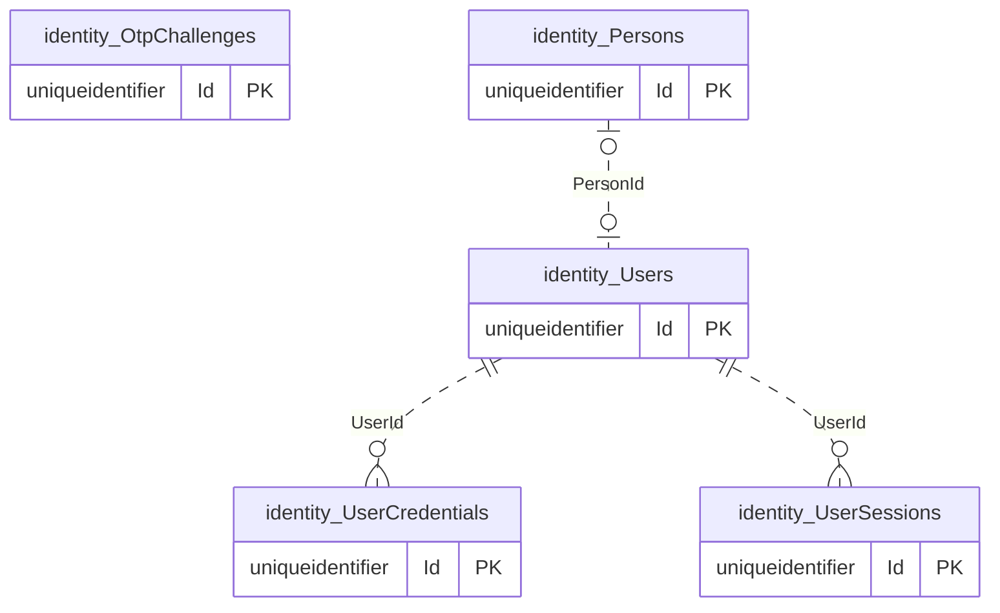
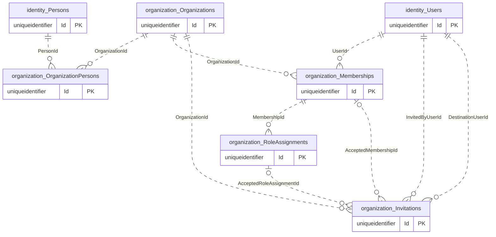
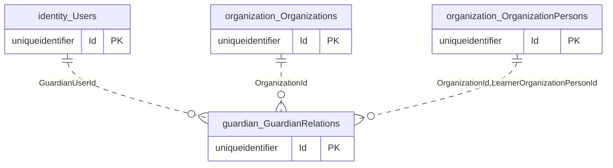
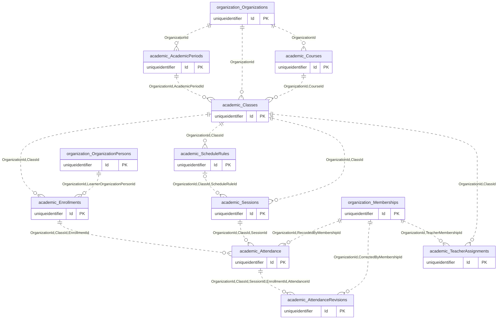
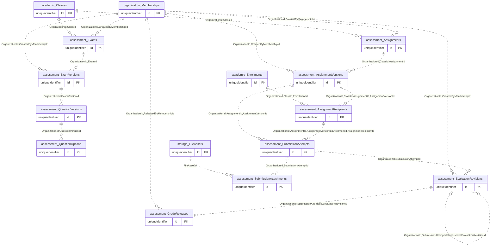
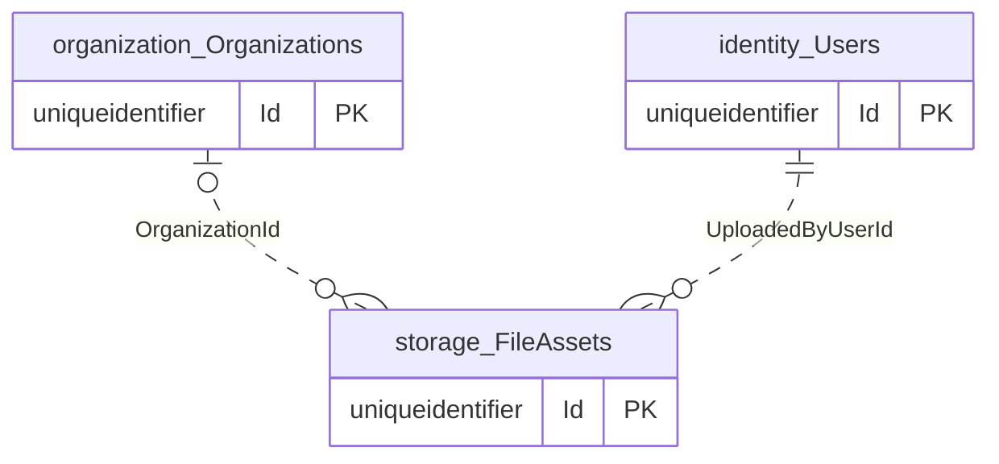

# ساختار فعلی دیتابیس Makan

این سند برای یادگیری دیتابیس از پایه نوشته شده و تصویر **کد و migrationهای موجود در ۲۰۲۶-۱۰-۰۷** است؛ گزارش اتصال به یک دیتابیس مستقرشده نیست. مبنای بررسی، commit `fb2cd743b3afc086a60e6943e5632b1957c018bf` در شاخه `main` است. اینکه یک محیط واقعاً تا آخرین migration ارتقا یافته باشد، در این بررسی احراز نشده است.

**پیاده‌سازی‌شده اکنون** در این سند یعنی entity، نگاشت EF Core و migration متناظر در repository وجود دارند. وجود جدول یا مقدار enum الزاماً به معنی وجود تمام endpointها و گردش‌های محصول نیست. **برنامه‌ریزی‌شده، هنوز پیاده‌سازی نشده** یعنی در اسناد هدف مطرح شده، اما ساختار یا جریان موردنظر در کد فعلی وجود ندارد.

## ۱. منابع و روش خواندن سند

منابع ساختار واقعی:

- [MakanDbContext](../MakanApp.Infrastructure/Persistence/MakanDbContext.cs): فهرست ۴۶ entity ذخیره‌شونده و اعمال configurationهای همان assembly با `ApplyConfigurationsFromAssembly`.
- [تمام configurationها](../MakanApp.Infrastructure/Persistence/Configurations): نام schema/table، نگاشت property، کلید، index، FK و CHECK.
- [migrationها و snapshot](../MakanApp.Infrastructure/Persistence/Migrations): ۱۶ migration همراه فایل‌های Designer و `MakanDbContextModelSnapshot`؛ آخرین migration برابر `20261006202655_AddExamAuthoringFoundation` است.
- [مدل‌های Domain](../MakanApp.Domain): معنای داده، enumها و قواعد تغییر وضعیت. `MessagingRealtimeOutboxMessage` استثناست و به دلیل مسئولیت فنی در [Infrastructure](../MakanApp.Infrastructure/Messaging/MessagingRealtimeOutboxMessage.cs) قرار دارد.
- سرویس‌های Application و پیاده‌سازی‌های `Ef*Store` برای توضیح جریان واقعی خواندن، نوشتن، مجوز و تراکنش.

منابع مقایسه معماری: [SQL Server Override](project-context/01_SQLSERVER_ARCHITECTURE_OVERRIDE.md)، [معماری v3](project-context/02_Makan_Architecture_v3_Original_MySQL_Reference.pdf)، [راهنمای پروژه](project-context/00_CODEX_START_HERE.md) و [اسناد مراحل اجرا](architecture). سند وضعیت پروژه و UX مرجع نیاز محصول هستند، نه مدرک وجود جدول backend.

برای شروع، بخش مفاهیم و روابط را بخوانید؛ سپس فرهنگ جدول‌ها را در کنار configuration هر جدول باز کنید. فهرست migrationها تاریخچه تغییر مدل است. بخش آخر، «How data flows through Makan»، هفت سناریوی عملی را به همین جدول‌ها متصل می‌کند.

## ۲. مفاهیم پایه با مثال همین پروژه

| مفهوم | معنی در Makan |
|---|---|
| Database | یک دیتابیس اصلی SQL Server برای داده تراکنشی؛ یک `MakanDbContext` اصلی |
| Schema | فضای نام جدول‌های یک بخش، مانند `academic`؛ schema به‌تنهایی مجوز مشاهده داده ایجاد نمی‌کند |
| Table / Entity | مثلاً کلاس C# به نام `Enrollment` به جدول `academic.Enrollments` نگاشت می‌شود |
| PK | شناسه یکتای ردیف؛ هر ۴۶ جدول فعلی PK تک‌ستونی `Id` از نوع `uniqueidentifier` دارند |
| FK | وجود مرجع را تضمین می‌کند؛ مثلاً ثبت‌نام باید به کلاس موجود وصل باشد |
| FK مرکب | علاوه بر وجود مرجع، تطابق بافت را هم تضمین می‌کند؛ `(OrganizationId, ClassId)` نمی‌تواند کلاس سازمان دیگری را انتخاب کند |
| Alternate Key / UQ | کلید یکتای اضافی که مقصد FK مرکب می‌شود؛ با index عادی تفاوت دارد |
| Unique Index | دو ردیف با کلید یکسان را رد می‌کند؛ مثل شماره نسخه در یک تکلیف |
| Filtered Index | فقط ردیف‌های منطبق با شرط را پوشش می‌دهد؛ نوع unique آن اجازه تاریخچه متعدد ولی فقط یک رابطه فعال می‌دهد |
| CHECK | شرط روی داده ردیف؛ مانند `Capacity > 0`. شرط ظرفیت، تعداد ثبت‌نام‌های جدول دیگر را کنترل نمی‌کند |
| NULL | نبود مقدار؛ مثلاً حساب تازه ممکن است هنوز `PersonId` نداشته باشد |
| rowversion | توکن دودویی تولیدشده SQL Server برای تشخیص update هم‌زمان؛ زمان، تاریخ یا شماره نسخه کسب‌وکاری نیست |
| Transaction | چند تغییر مرتبط را یکجا commit می‌کند؛ مثل انتشار ارزیابی و ایجاد رسید انتشار نمره |
| Idempotency | تکرار درخواست، اثر کسب‌وکاری تکراری نسازد؛ دامنه این تضمین در هر use case متفاوت است |

نام واقعی جدول‌ها و ستون‌ها در مدل فعلی `PascalCase` است. مثال‌های snake_case در معماری، نام واقعی جدول‌ها نیستند. schema سازمان **`organization`** است، نه `org`.

شناسه‌ها در Domain معمولاً با `Guid.NewGuid()` ساخته می‌شوند؛ وجود `ValueGeneratedOnAdd` در snapshot را با SQL default مانند `NEWSEQUENTIALID()` اشتباه نگیرید. زمان رویدادها عمدتاً `datetime2(7)` و مطابق قرارداد سرور UTC است؛ خود `datetime2` منطقه زمانی یا `DateTime.Kind` را ذخیره نمی‌کند. تاریخ‌های ترم و رخداد محلی `date`، زمان برنامه هفتگی `time(0)`، متن فارسی `nvarchar`، مقادیر منطقی `bit`، شمارنده پیام `bigint` و نمره `decimal(9,2)` هستند. `FileAssets.Sha256Hash` یک استثنای متنی `varchar(64)` است.

enumها عمدتاً به `int` ذخیره می‌شوند. مثلاً «فعال» برای `Membership` مقدار ۱، برای `Class` مقدار ۲ و برای `GuardianRelation` مقدار ۲ است؛ یک عدد را به همه جدول‌ها تعمیم ندهید. `UserSessions.SelectedRole` برعکس، نام نقش را به شکل رشته نگه می‌دارد.

حذف مرجع در بیشتر روابط `Restrict` است تا تاریخچه بی‌صدا حذف نشود. استثناهای `Cascade` فقط `User -> UserCredential`، `User -> UserSession` و `QuestionVersion -> QuestionOption` هستند. این تنظیم مجوز endpoint حذف نیست. قوانین تغییرناپذیری نسخه منتشرشده عمدتاً در Domain/Application اجرا می‌شوند؛ FK و rowversion به‌تنهایی جلوی SQL مستقیمِ ناقض این قواعد را نمی‌گیرند.

## ۳. نقشه schemaهای پیاده‌سازی‌شده

| Schema | تعداد جدول | هدف |
|---|---:|---|
| [identity](#schema-identity) | ۵ | فرد، حساب، روش ورود، OTP و نشست ورود |
| [organization](#schema-organization) | ۵ | آموزشگاه، پرونده فرد، عضویت حساب، نقش و دعوت |
| [guardian](#schema-guardian) | ۱ | رابطه مجاز والد با پرونده دانش‌آموز در آموزشگاه |
| [academic](#schema-academic) | ۹ | ترم، درس، کلاس، ثبت‌نام، انتساب معلم، برنامه، جلسه و حضور |
| [assessment](#schema-assessment) | ۱۱ | تکلیف و تحویل و نمره؛ تألیف و انتشار نسخه آزمون |
| [storage](#schema-storage) | ۱ | فراداده و چرخه عمر فایل |
| [messaging](#schema-messaging) | ۱۴ | گفتگو، پیام و تاریخچه، تعامل‌ها، همگام‌سازی و ایمنی |
| **جمع** | **۴۶** | **۴۵۱ ستون، ۹۶ FK، ۱۰۷ CHECK، ۱۱۶ index مستقل از PK/UQ** |

از ۱۱۶ index مدل، ۴۳ مورد unique و ۲۲ مورد فیلترشده‌اند؛ ۲۱ index هر دو ویژگی را دارند. ۳۷ جدول `RowVersion` دارند. جدول داخلی تاریخچه migrationهای EF، entity کسب‌وکاری نیست و در این شمارش نیست؛ وضعیت واقعی آن در هیچ محیطی خوانده نشده است.

schemaهای پیشنهادی `curriculum`، `knowledge`، `intelligence`، `copilot`، `commerce`، `notification`، `audit`، `infra` و `platform` در migrationهای فعلی ایجاد نشده‌اند. نام یک ماژول در معماری دلیل وجود schema یا جدول آن نیست.

## ۴. روابط را قبل از ستون‌ها بفهمیم

### ۴.۱ فرد، حساب و آموزشگاه چهار مفهوم متفاوت‌اند

`Person` اطلاعات فرد مانند نام را نگه می‌دارد. `User` حساب ورود است و FK اختیاری و unique به `Person` دارد: یک User حداکثر یک Person و هر Person حداکثر یک User دارد؛ وجود هر یک بدون دیگری از نظر مدل ممکن است. شماره موبایل در `UserCredentials` است، نه کلید اصلی Person یا User.

`OrganizationPerson` اتصال پرونده فرد به آموزشگاه است و حتی برای فردی که حساب ورود ندارد قابل ذخیره است. `Membership` اتصال **User** به آموزشگاه است. هیچ FK مستقیمی بین Membership و OrganizationPerson وجود ندارد؛ در مسیر دانش‌آموز، از `User.PersonId` و `OrganizationPerson.PersonId` در سازمان معتبر استفاده می‌شود. پذیرش دعوت، عضویت و نقش می‌سازد؛ در کد فعلی ایجاد خودکار OrganizationPerson یا Enrollment بخشی از آن نیست.

`RoleAssignment` نقش را به Membership می‌دهد. یک حساب می‌تواند در چند آموزشگاه عضو باشد و یک عضویت چند نقش داشته باشد. `OrganizationRole` مقادیر `Student=1`، `Teacher=2`، `Parent=3` و `Manager=4` دارد؛ جدول مستقل `Roles` یا `Permissions` وجود ندارد و `User.Role` هم وجود ندارد.

`UserSession` نشست احراز هویت است؛ با `academic.Session` که یک جلسه آموزشی است اشتباه نشود. فیلدهای `SelectedMembershipId` و `SelectedSubjectOrganizationPersonId` **FK ندارند**؛ انتخاب ذخیره‌شده‌اند و سرویس‌ها باید اعتبارشان را دوباره بررسی کنند. `SelectedRole` نیز اثبات داشتن نقش نیست. فضای شخصی جدول مستقلی ندارد؛ انتخاب شخصی با خالی شدن این انتخاب‌ها نمایش داده می‌شود.

### ۴.۲ از درس به کلاس و از فرد به ثبت‌نام

`Course` تعریف درس مستقل از ترم است. `AcademicPeriod` ترم یا بازه تحصیلی است. `Class` اجرای یک Course در یک AcademicPeriod و یک Organization است. FKهای مرکب تضمین می‌کنند درس و ترم هر دو متعلق به سازمان کلاس باشند. مثبت بودن ظرفیت CHECK است؛ رعایت ظرفیت هنگام ثبت‌نام با تراکنش و قفل روی کلاس انجام می‌شود و ستون `ActiveCount` در مدل وجود ندارد.

`Enrollment` به OrganizationPerson فراگیر وصل است؛ دانش‌آموز را با `UserId` یا `MembershipId` ثبت‌نام نمی‌کند. در مقابل، `TeacherAssignment` به **Membership معلم** وصل است. FK هم‌سازمانی را تضمین می‌کند، اما فعال بودن عضویت و نقش Teacher باید در سرویس کنترل شود. کلاس می‌تواند چند معلم داشته باشد؛ index فقط تکرار همان معلم فعال در همان کلاس را منع می‌کند.

`ScheduleRule` قانون تکرار به زمان محلی است و `Session` رخداد واقعی با `StartUtc/EndUtc`. جلسه می‌تواند دستی باشد و `ScheduleRuleId` نداشته باشد. `Attendance` یک وضعیت برای زوج جلسه/ثبت‌نام است؛ FKهای مرکب مانع اتصال جلسه و ثبت‌نام از دو کلاس مختلف می‌شوند. `NotRecorded=0` در enum وجود دارد ولی CHECK جدول آن را نمی‌پذیرد؛ نبود ردیف حضور، همان حالت ثبت‌نشده است. اصلاح حضور، `AttendanceRevision` با وضعیت قبل/بعد و دلیل می‌سازد.

### ۴.۳ والد، خود دانش‌آموز نیست

`GuardianRelation` یک User والد را به `LearnerOrganizationPersonId` در همان Organization متصل می‌کند؛ FK مرکب، پرونده کودک از سازمان دیگر را رد می‌کند. این رابطه با عضویت Parent یکی نیست و به‌تنهایی نقش Parent نمی‌دهد. والد ممکن است به چند کودک مرتبط باشد و یک کودک چند والد مجاز داشته باشد؛ unique index فقط تکرار همان رابطه فعال را منع می‌کند.

برای خواندن داده کودک، سرویس علاوه بر نشست و عضویت و نقش Parent، فعال بودن رابطه، `ValidFromUtc` و پرونده کودک را بررسی می‌کند. انتخاب ChildId یا انتخاب قبلی نشست مجوز دائمی نیست. این رابطه دسترسی به چت خصوصی کودک، پاسخ خصوصی تکلیف یا کلید پاسخ آزمون ایجاد نمی‌کند.

### ۴.۴ تکلیف، نسخه، گیرنده، پاسخ، ارزیابی و انتشار

`Assignment` هویت پایدار تکلیف کلاس است. `AssignmentVersion` متن و سیاست ثابت آن، شامل deadline، تأخیر، تعداد تلاش و سقف نمره است. `CurrentVersionNumber` عدد است و FK به نسخه نیست. مدل فعلی نسخه اولیه و ویرایش draft و انتشار را دارد؛ API ساخت نسخه بعدی تکلیف هنوز وجود ندارد.

هنگام انتشار، `AssignmentRecipient` برای enrollmentهای فعال همان زمان ساخته می‌شود؛ این جدول snapshot مخاطبان **نسخه** است. اضافه شدن دانش‌آموز به کلاس پس از انتشار، خودبه‌خود او را گیرنده نسخه قدیمی نمی‌کند.

`SubmissionAttempt` به همان AssignmentVersion و AssignmentRecipient و Enrollment مقید است. FK پنج‌ستونی گیرنده مانع ترکیب پرونده پاسخ با گیرنده یا نسخه دیگری می‌شود. یک گیرنده می‌تواند چند تلاش تاریخی داشته باشد ولی فقط یک draft برای همان نسخه. `SubmissionAttachment` اتصال تلاش به `FileAsset` است؛ بایت فایل در پاسخ ذخیره نمی‌شود.

`EvaluationRevision` نمره و feedback یک تلاش ارسال‌شده است. `Score >= 0` در SQL تضمین می‌شود؛ `Score <= AssignmentVersion.MaxScore` قاعده Domain/Application است. `GradeRelease` رسید انتشار صریح همان revision است. صرف وجود نمره draft مجوز نمایش آن به دانش‌آموز یا والد نیست.

اصلاح نمره یک revision جدید با `SupersedesEvaluationRevisionId` و دلیل می‌سازد. index با کلید `(OrganizationId, SubmissionAttemptId, Status)` و فیلتر `Status IN (1,2)` اجازه **یک Draft و یک Released به‌طور هم‌زمان** می‌دهد؛ معنی آن «فقط یک ردیف در مجموع» نیست. تا انتشار اصلاح، نتیجه منتشرشده قبلی قابل مشاهده می‌ماند؛ سپس قبلی `Superseded` می‌شود. `LearnerFeedback`، `GuardianVisibleFeedback` و `TeacherPrivateNote` مخاطبان متفاوت دارند.

### ۴.۵ فایل، یک منبع مشترک با مجوز وابسته به محل مصرف

`FileAsset` فقط metadata، کلید ذخیره، اندازه، hash، مالک و lifecycle را دارد. `OrganizationId` اختیاری است تا فایل شخصی هم ممکن باشد. `SubmissionAttachments` و `MessageAttachments` فقط به `FileAssetId` FK دارند؛ تطابق سازمان، uploader، وضعیت Ready و مجوز استفاده از فایل با FK تضمین نشده و در سرویس‌ها کنترل می‌شود.

`RetainedAtUtc` فایل متصل به سابقه معتبر را از حذف عادی محافظت می‌کند. این ستون جای سیاست جامع retention نیست. دانستن شناسه یا StorageKey اجازه دانلود نیست؛ resolver دسترسی باید رابطه فعلی با منبع مصرف را کنترل کند. جدول مستقل upload session، multipart upload، نتیجه scan یا binding عمومی فایل وجود ندارد.

### ۴.۶ پیام، تاریخچه و تغییرات همگام‌سازی

`Conversation` یک گفتگو با `Type` مستقیم/گروه/کانال، `Scope` شخصی/سازمانی و سیاست مدیریت است. scope شخصی سازمان ندارد و scope سازمانی باید سازمان داشته باشد. `DirectUserPair` دو شناسه را در کد مرتب می‌کند؛ CHECK فقط متفاوت بودنشان را کنترل می‌کند و ترتیب canonical را SQL تحمیل نمی‌کند. index یکتا اجازه یک گفتگوی مستقیم برای همان زوج و scope/سازمان را می‌دهد، حتی اگر گفتگوی قبلی archive شده باشد.

`ConversationParticipant` عضویت **User** در گفتگو است؛ نه OrganizationPerson و نه Membership سازمانی. خروج یا حذف، ردیف عضویت را پایان می‌دهد و ورود مجدد یک lifecycle تازه می‌سازد. `Message.SenderParticipantId` همراه ConversationId و SenderUserId به همان lifecycle فرستنده FK دارد. یک Owner فعال حداکثر مجاز است؛ index «وجود حداقل یک Owner» را تضمین نمی‌کند و Direct معمولاً Owner ندارد.

`Message` محتوای جاری و sequence پیام را نگه می‌دارد. `MessageRevision` نسخه متن برای تاریخچه است. `ReplyToMessageId` با FK مرکب فقط پیام همان گفتگو را می‌پذیرد؛ `ForwardedFromMessageId` FK ساده دارد و مجاز بودن انتقال میان scopeها در سرویس بررسی می‌شود. منشن، واکنش، سنجاق و پیوست جدول‌های جدا دارند. منشن به‌تنهایی مجوز دسترسی جدید نمی‌دهد.

`MessagingChangeEvent` نام کلاس است و **`messaging.ChangeEvents`** نام جدول؛ entity مستقلی با نام `ChangeEvent` وجود ندارد. `Message.Sequence` برای ترتیب پیام‌ها و `ChangeSequence` برای تغییرات از جمله edit/delete/reaction است. `ResourceId` در ChangeEvents مرجع چندنوعی است و FK عمومی به همه منابع ندارد. `ResourceVersion` رشته نسخه منبع است، نه rowversion خود event.

`MessagingRealtimeOutboxMessage` به ChangeEvent متصل است و در جدول **`messaging.RealtimeOutbox`** نگه‌داری می‌شود. این جدول ارسال اعلان پس از commit، lease و retry را پشتیبانی می‌کند؛ outbox عمومی همه ماژول‌ها نیست. cursorهای Delivered/Read روی Participant هستند؛ جدول per-device receipt یا ستون ذخیره‌شده UnreadCount وجود ندارد.

`UserBlock` رابطه جهت‌دار میان دو User است؛ با PersonalCommunicationGrant که زوج بدون جهت و مجوز تماس شخصی است متفاوت است. `AbuseReport` به پیام همان گفتگو، گزارش‌دهنده و کاربر گزارش‌شده وصل است و snapshot محتوا و نسخه گزارش‌شده را حفظ می‌کند. `ReportedMessageVersion` با نوع `binary(8)` یک کپی ثابت از نسخه است؛ rowversion خود گزارش ستون دیگری است. وجود enumهای بررسی/حل گزارش به معنی پیاده‌سازی گردش moderation نیست.

### ۴.۷ آزمون: تألیف و انتشار موجود، اجرای تلاش هنوز غایب

چهار entity فعلی عبارت‌اند از `Exam`، `ExamVersion`، `QuestionVersion` و `QuestionOption`. Exam به کلاس تعلق دارد؛ نسخه شامل بازه دسترسی، مدت، تعداد تلاش، سقف نمره و سیاست ترتیب سؤال است. نسخه منتشرشده تغییرناپذیر است و ساخت نسخه بعدی سؤال‌ها و گزینه‌ها را با شناسه‌های تازه کپی می‌کند.

`CurrentVersionNumber` نسخه editor و `LatestPublishedVersionNumber` نسخه قابل ارائه را نشان می‌دهند. هیچ‌کدام FK به ExamVersions نیستند. سؤال از نوع `ObjectiveSingleChoice=1` یا `Descriptive=2` است. گزینه صحیح با `QuestionOptions.IsCorrect` ذخیره می‌شود. «حداقل دو گزینه و دقیقاً یکی صحیح» و «مجموع امتیاز سؤال‌ها برابر MaxScore» در Domain هنگام اعتبارسنجی/انتشار کنترل می‌شوند؛ CHECKهای SQL فقط مثبت بودن امتیاز، نوع مجاز و ترتیب مثبت را تضمین می‌کنند.

**برنامه‌ریزی‌شده، هنوز پیاده‌سازی نشده:** ExamAttempt، AnswerRevision، timer/deadline اختصاصی تلاش، autosave پاسخ، write lease، finalize، تصحیح و انتشار نتیجه آزمون. `SubmissionAttempt` موجود مخصوص تکلیف است و `GradeRelease` فعلی نیز از EvaluationRevision تکلیف می‌آید؛ نباید آن‌ها را جدول تلاش و نتیجه آزمون معرفی کرد.

## ۵. فرهنگ کامل جدول‌ها بر اساس مدل فعلی

در هر جدول، ستون‌ها و nullable بودن، PK/UQ، تمام FKها، indexها، CHECKها و توکن concurrency فهرست شده‌اند. «ندارد» یعنی آن قید در مدل فعلی تعریف نشده است، نه اینکه آن رابطه از نظر محصول بی‌معنی باشد. SQL نوشته‌شده در CHECK و filter عین قرارداد مدل است؛ توضیحات روابط در بخش قبل مرز ضمانت دیتابیس و کنترل سرویس را مشخص می‌کند.

### Schema `identity`

#### `identity.Users` — پیاده‌سازی‌شده اکنون

حساب ورود؛ PersonId ارتباط اختیاری با فرد، Username نام نمایشی حساب و NormalizedUsername کلید جست‌وجو/یکتایی است. CommunicationAgeCategory برای سیاست ارتباط استفاده می‌شود.

منبع: [User](../MakanApp.Domain/Identity/User.cs) و [نگاشت EF Core](../MakanApp.Infrastructure/Persistence/Configurations/Identity/UserConfiguration.cs).

**چرخه عمر و وضعیت:** CommunicationAgeCategory: Unknown=0، Minor=1، Adult=2؛ ProfileCompletedAtUtc زمان تکمیل اولیه و UpdatedAtUtc زمان تغییر است. Status عمومی حساب وجود ندارد.

| ستون | نوع SQL Server | NULL مجاز؟ |
|---|---|---|
| `Id` | `uniqueidentifier` | خیر |
| `CommunicationAgeCategory` | `int` | خیر |
| `CreatedAtUtc` | `datetime2(7)` | خیر |
| `NormalizedUsername` | `nvarchar(32)` | بله |
| `PersonId` | `uniqueidentifier` | بله |
| `ProfileCompletedAtUtc` | `datetime2(7)` | بله |
| `RowVersion` | `rowversion` | خیر |
| `UpdatedAtUtc` | `datetime2(7)` | بله |
| `Username` | `nvarchar(32)` | بله |

**کلیدها:**

- `PK_Users`: `(Id)`؛ کلید اصلی.
- کلید جایگزین ندارد.

**Foreign Keyها:**

| ستون‌های وابسته | جدول و کلید مرجع | رفتار حذف مرجع |
|---|---|---|
| `(PersonId)` | `identity.Persons` `(Id)` | `Restrict` |

**Indexها (جدا از PK و کلید جایگزین):**

| نام | ستون‌ها | نوع | شرط فیلتر |
|---|---|---|---|
| `UX_Users_NormalizedUsername` | `(NormalizedUsername)` | یکتا | `[NormalizedUsername] IS NOT NULL` |
| `IX_Users_PersonId` | `(PersonId)` | یکتا | `[PersonId] IS NOT NULL` |

**CHECKها:**

- `CK_Users_CommunicationAgeCategory`: `[CommunicationAgeCategory] IN (0, 1, 2)`

**Concurrency:** `RowVersion` از نوع `rowversion` و concurrency token مدل EF Core است.

#### `identity.Persons` — پیاده‌سازی‌شده اکنون

اطلاعات فرد شامل FirstName، LastName و DisplayName؛ مستقل از آموزشگاه و حساب ورود.

منبع: [Person](../MakanApp.Domain/Identity/Person.cs) و [نگاشت EF Core](../MakanApp.Infrastructure/Persistence/Configurations/Identity/PersonConfiguration.cs).

**چرخه عمر و وضعیت:** CreatedAtUtc و UpdatedAtUtc؛ Status و soft-delete عمومی ندارد.

| ستون | نوع SQL Server | NULL مجاز؟ |
|---|---|---|
| `Id` | `uniqueidentifier` | خیر |
| `CreatedAtUtc` | `datetime2(7)` | خیر |
| `DisplayName` | `nvarchar(200)` | بله |
| `FirstName` | `nvarchar(100)` | خیر |
| `LastName` | `nvarchar(100)` | خیر |
| `RowVersion` | `rowversion` | خیر |
| `UpdatedAtUtc` | `datetime2(7)` | بله |

**کلیدها:**

- `PK_Persons`: `(Id)`؛ کلید اصلی.
- کلید جایگزین ندارد.

**Foreign Keyها:**

ندارد.

**Indexها (جدا از PK و کلید جایگزین):**

ندارد؛ بنابراین unique index و filtered index مستقل هم ندارد.

**CHECKها:**

ندارد. قواعد Domain را نباید CHECK دیتابیس فرض کرد.

**Concurrency:** `RowVersion` از نوع `rowversion` و concurrency token مدل EF Core است.

#### `identity.UserCredentials` — پیاده‌سازی‌شده اکنون

روش ورود User؛ Kind و NormalizedIdentifier زوج یکتای شناسه ورود هستند. فعلاً CredentialKind فقط MobilePhone=1 دارد؛ این جدول رمز عبور ندارد.

منبع: [UserCredential](../MakanApp.Domain/Identity/UserCredential.cs) و [نگاشت EF Core](../MakanApp.Infrastructure/Persistence/Configurations/Identity/UserCredentialConfiguration.cs).

**چرخه عمر و وضعیت:** CreatedAtUtc و VerifiedAtUtc؛ enum نوع credential در Domain است، CHECK مخصوص Kind تعریف نشده است.

| ستون | نوع SQL Server | NULL مجاز؟ |
|---|---|---|
| `Id` | `uniqueidentifier` | خیر |
| `CreatedAtUtc` | `datetime2(7)` | خیر |
| `Kind` | `int` | خیر |
| `NormalizedIdentifier` | `nvarchar(32)` | خیر |
| `RowVersion` | `rowversion` | خیر |
| `UserId` | `uniqueidentifier` | خیر |
| `VerifiedAtUtc` | `datetime2(7)` | خیر |

**کلیدها:**

- `PK_UserCredentials`: `(Id)`؛ کلید اصلی.
- کلید جایگزین ندارد.

**Foreign Keyها:**

| ستون‌های وابسته | جدول و کلید مرجع | رفتار حذف مرجع |
|---|---|---|
| `(UserId)` | `identity.Users` `(Id)` | `Cascade` |

**Indexها (جدا از PK و کلید جایگزین):**

| نام | ستون‌ها | نوع | شرط فیلتر |
|---|---|---|---|
| `IX_UserCredentials_UserId` | `(UserId)` | غیریکتا | بدون فیلتر |
| `UX_UserCredentials_Kind_Identifier` | `(Kind, NormalizedIdentifier)` | یکتا | بدون فیلتر |

filtered index ندارد.

**CHECKها:**

ندارد. قواعد Domain را نباید CHECK دیتابیس فرض کرد.

**Concurrency:** `RowVersion` از نوع `rowversion` و concurrency token مدل EF Core است.

#### `identity.OtpChallenges` — پیاده‌سازی‌شده اکنون

چالش موقت ورود با NormalizedPhoneNumber، CodeHash و Salt؛ کد خام ذخیره نمی‌شود. FailedAttempts و MaxFailedAttempts تعداد تلاش ناموفق را کنترل می‌کنند.

منبع: [OtpChallenge](../MakanApp.Domain/Identity/OtpChallenge.cs) و [نگاشت EF Core](../MakanApp.Infrastructure/Persistence/Configurations/Identity/OtpChallengeConfiguration.cs).

**چرخه عمر و وضعیت:** ExpiresAtUtc انقضا، ConsumedAtUtc مصرف موفق و SupersededAtUtc جایگزینی چالش؛ Status ندارد و انقضا با ساعت سرور بررسی می‌شود.

| ستون | نوع SQL Server | NULL مجاز؟ |
|---|---|---|
| `Id` | `uniqueidentifier` | خیر |
| `CodeHash` | `varbinary(32)` | خیر |
| `ConsumedAtUtc` | `datetime2(7)` | بله |
| `CreatedAtUtc` | `datetime2(7)` | خیر |
| `ExpiresAtUtc` | `datetime2(7)` | خیر |
| `FailedAttempts` | `int` | خیر |
| `MaxFailedAttempts` | `int` | خیر |
| `NormalizedPhoneNumber` | `nvarchar(32)` | خیر |
| `RowVersion` | `rowversion` | خیر |
| `Salt` | `varbinary(16)` | خیر |
| `SupersededAtUtc` | `datetime2(7)` | بله |

**کلیدها:**

- `PK_OtpChallenges`: `(Id)`؛ کلید اصلی.
- کلید جایگزین ندارد.

**Foreign Keyها:**

ندارد.

**Indexها (جدا از PK و کلید جایگزین):**

| نام | ستون‌ها | نوع | شرط فیلتر |
|---|---|---|---|
| `IX_OtpChallenges_Phone_CreatedAtUtc` | `(NormalizedPhoneNumber, CreatedAtUtc)` | غیریکتا | بدون فیلتر |

unique index مستقل ندارد.

filtered index ندارد.

**CHECKها:**

ندارد. قواعد Domain را نباید CHECK دیتابیس فرض کرد.

**Concurrency:** `RowVersion` از نوع `rowversion` و concurrency token مدل EF Core است.

#### `identity.UserSessions` — پیاده‌سازی‌شده اکنون

نشست ورود با UserId و TokenHash؛ انتخاب workspace و کودک با SelectedMembershipId، SelectedRole و SelectedSubjectOrganizationPersonId ذخیره می‌شود و سه ستون انتخابی FK ندارند.

منبع: [UserSession](../MakanApp.Domain/Identity/UserSession.cs) و [نگاشت EF Core](../MakanApp.Infrastructure/Persistence/Configurations/Identity/UserSessionConfiguration.cs).

**چرخه عمر و وضعیت:** CreatedAtUtc، ExpiresAtUtc و RevokedAtUtc؛ IsActive محاسباتی است و ستون SQL نیست.

| ستون | نوع SQL Server | NULL مجاز؟ |
|---|---|---|
| `Id` | `uniqueidentifier` | خیر |
| `CreatedAtUtc` | `datetime2(7)` | خیر |
| `ExpiresAtUtc` | `datetime2(7)` | خیر |
| `RevokedAtUtc` | `datetime2(7)` | بله |
| `RowVersion` | `rowversion` | خیر |
| `SelectedMembershipId` | `uniqueidentifier` | بله |
| `SelectedRole` | `nvarchar(16)` | بله |
| `SelectedSubjectOrganizationPersonId` | `uniqueidentifier` | بله |
| `TokenHash` | `varbinary(32)` | خیر |
| `UserId` | `uniqueidentifier` | خیر |

**کلیدها:**

- `PK_UserSessions`: `(Id)`؛ کلید اصلی.
- کلید جایگزین ندارد.

**Foreign Keyها:**

| ستون‌های وابسته | جدول و کلید مرجع | رفتار حذف مرجع |
|---|---|---|
| `(UserId)` | `identity.Users` `(Id)` | `Cascade` |

**Indexها (جدا از PK و کلید جایگزین):**

| نام | ستون‌ها | نوع | شرط فیلتر |
|---|---|---|---|
| `UX_UserSessions_TokenHash` | `(TokenHash)` | یکتا | بدون فیلتر |
| `IX_UserSessions_UserId` | `(UserId)` | غیریکتا | بدون فیلتر |

filtered index ندارد.

**CHECKها:**

ندارد. قواعد Domain را نباید CHECK دیتابیس فرض کرد.

**Concurrency:** `RowVersion` از نوع `rowversion` و concurrency token مدل EF Core است.

### Schema `organization`

#### `organization.Organizations` — پیاده‌سازی‌شده اکنون

آموزشگاه با Name و شناسه پایدار؛ فاقد TimeZoneId یا تنظیمات تجاری در مدل فعلی.

منبع: [Organization](../MakanApp.Domain/Organization/Organization.cs) و [نگاشت EF Core](../MakanApp.Infrastructure/Persistence/Configurations/Organization/OrganizationConfiguration.cs).

**چرخه عمر و وضعیت:** Status: Active=1، Suspended=2؛ CreatedAtUtc زمان ایجاد.

| ستون | نوع SQL Server | NULL مجاز؟ |
|---|---|---|
| `Id` | `uniqueidentifier` | خیر |
| `CreatedAtUtc` | `datetime2(7)` | خیر |
| `Name` | `nvarchar(200)` | خیر |
| `RowVersion` | `rowversion` | خیر |
| `Status` | `int` | خیر |

**کلیدها:**

- `PK_Organizations`: `(Id)`؛ کلید اصلی.
- کلید جایگزین ندارد.

**Foreign Keyها:**

ندارد.

**Indexها (جدا از PK و کلید جایگزین):**

ندارد؛ بنابراین unique index و filtered index مستقل هم ندارد.

**CHECKها:**

- `CK_Organizations_Status`: `[Status] IN (1, 2)`

**Concurrency:** `RowVersion` از نوع `rowversion` و concurrency token مدل EF Core است.

#### `organization.Memberships` — پیاده‌سازی‌شده اکنون

اتصال حساب User به Organization. Suspended با Ended فرق دارد و index فعال فقط Status=1 با EndedAtUtc خالی را پوشش می‌دهد.

منبع: [Membership](../MakanApp.Domain/Organization/Membership.cs) و [نگاشت EF Core](../MakanApp.Infrastructure/Persistence/Configurations/Organization/MembershipConfiguration.cs).

**چرخه عمر و وضعیت:** Status: Active=1، Suspended=2، Ended=3؛ CreatedAtUtc، ActivatedAtUtc و EndedAtUtc.

| ستون | نوع SQL Server | NULL مجاز؟ |
|---|---|---|
| `Id` | `uniqueidentifier` | خیر |
| `ActivatedAtUtc` | `datetime2(7)` | خیر |
| `CreatedAtUtc` | `datetime2(7)` | خیر |
| `EndedAtUtc` | `datetime2(7)` | بله |
| `OrganizationId` | `uniqueidentifier` | خیر |
| `RowVersion` | `rowversion` | خیر |
| `Status` | `int` | خیر |
| `UserId` | `uniqueidentifier` | خیر |

**کلیدها:**

- `PK_Memberships`: `(Id)`؛ کلید اصلی.
- `UQ_Memberships_OrganizationId_Id`: `(OrganizationId, Id)`؛ کلید جایگزین یکتا برای ارجاع مرکب.

**Foreign Keyها:**

| ستون‌های وابسته | جدول و کلید مرجع | رفتار حذف مرجع |
|---|---|---|
| `(OrganizationId)` | `organization.Organizations` `(Id)` | `Restrict` |
| `(UserId)` | `identity.Users` `(Id)` | `Restrict` |

**Indexها (جدا از PK و کلید جایگزین):**

| نام | ستون‌ها | نوع | شرط فیلتر |
|---|---|---|---|
| `UX_Memberships_Active_User_Organization` | `(UserId, OrganizationId)` | یکتا | `[Status] = 1 AND [EndedAtUtc] IS NULL` |

**CHECKها:**

- `CK_Memberships_Status`: `[Status] IN (1, 2, 3)`

**Concurrency:** `RowVersion` از نوع `rowversion` و concurrency token مدل EF Core است.

#### `organization.RoleAssignments` — پیاده‌سازی‌شده اکنون

انتساب OrganizationRole به Membership. Role: Student=1، Teacher=2، Parent=3، Manager=4؛ OrganizationId مستقیم ندارد و سازمان از عضویت معلوم می‌شود.

منبع: [RoleAssignment](../MakanApp.Domain/Organization/RoleAssignment.cs) و [نگاشت EF Core](../MakanApp.Infrastructure/Persistence/Configurations/Organization/RoleAssignmentConfiguration.cs).

**چرخه عمر و وضعیت:** Status: Active=1، Ended=2؛ AssignedAtUtc و EndedAtUtc.

| ستون | نوع SQL Server | NULL مجاز؟ |
|---|---|---|
| `Id` | `uniqueidentifier` | خیر |
| `AssignedAtUtc` | `datetime2(7)` | خیر |
| `EndedAtUtc` | `datetime2(7)` | بله |
| `MembershipId` | `uniqueidentifier` | خیر |
| `Role` | `int` | خیر |
| `RowVersion` | `rowversion` | خیر |
| `Status` | `int` | خیر |

**کلیدها:**

- `PK_RoleAssignments`: `(Id)`؛ کلید اصلی.
- کلید جایگزین ندارد.

**Foreign Keyها:**

| ستون‌های وابسته | جدول و کلید مرجع | رفتار حذف مرجع |
|---|---|---|
| `(MembershipId)` | `organization.Memberships` `(Id)` | `Restrict` |

**Indexها (جدا از PK و کلید جایگزین):**

| نام | ستون‌ها | نوع | شرط فیلتر |
|---|---|---|---|
| `UX_RoleAssignments_Active_Membership_Role` | `(MembershipId, Role)` | یکتا | `[Status] = 1 AND [EndedAtUtc] IS NULL` |

**CHECKها:**

- `CK_RoleAssignments_Role`: `[Role] IN (1, 2, 3, 4)`
- `CK_RoleAssignments_Status`: `[Status] IN (1, 2)`

**Concurrency:** `RowVersion` از نوع `rowversion` و concurrency token مدل EF Core است.

#### `organization.OrganizationPersons` — پیاده‌سازی‌شده اکنون

پرونده Person در Organization؛ جدا از Membership و بدون الزام حساب ورود. کلید جایگزین برای روابط آموزشی هم‌سازمانی استفاده می‌شود.

منبع: [OrganizationPerson](../MakanApp.Domain/Organization/OrganizationPerson.cs) و [نگاشت EF Core](../MakanApp.Infrastructure/Persistence/Configurations/Organization/OrganizationPersonConfiguration.cs).

**چرخه عمر و وضعیت:** Status: Active=1، Ended=2؛ CreatedAtUtc، ActivatedAtUtc و EndedAtUtc.

| ستون | نوع SQL Server | NULL مجاز؟ |
|---|---|---|
| `Id` | `uniqueidentifier` | خیر |
| `ActivatedAtUtc` | `datetime2(7)` | خیر |
| `CreatedAtUtc` | `datetime2(7)` | خیر |
| `EndedAtUtc` | `datetime2(7)` | بله |
| `OrganizationId` | `uniqueidentifier` | خیر |
| `PersonId` | `uniqueidentifier` | خیر |
| `RowVersion` | `rowversion` | خیر |
| `Status` | `int` | خیر |

**کلیدها:**

- `PK_OrganizationPersons`: `(Id)`؛ کلید اصلی.
- `UQ_OrganizationPersons_OrganizationId_Id`: `(OrganizationId, Id)`؛ کلید جایگزین یکتا برای ارجاع مرکب.

**Foreign Keyها:**

| ستون‌های وابسته | جدول و کلید مرجع | رفتار حذف مرجع |
|---|---|---|
| `(OrganizationId)` | `organization.Organizations` `(Id)` | `Restrict` |
| `(PersonId)` | `identity.Persons` `(Id)` | `Restrict` |

**Indexها (جدا از PK و کلید جایگزین):**

| نام | ستون‌ها | نوع | شرط فیلتر |
|---|---|---|---|
| `IX_OrganizationPersons_PersonId` | `(PersonId)` | غیریکتا | بدون فیلتر |
| `UX_OrganizationPersons_Active_Organization_Person` | `(OrganizationId, PersonId)` | یکتا | `[Status] = 1 AND [EndedAtUtc] IS NULL` |

**CHECKها:**

- `CK_OrganizationPersons_Status`: `[Status] IN (1, 2)`

**Concurrency:** `RowVersion` از نوع `rowversion` و concurrency token مدل EF Core است.

#### `organization.Invitations` — پیاده‌سازی‌شده اکنون

دعوت یک DestinationUserId توسط InvitedByUserId به Organization و Role مشخص؛ AcceptedMembershipId و AcceptedRoleAssignmentId نتیجه پذیرش را ثبت می‌کنند. این دو FK ساده‌اند و سازگاری نتیجه با دعوت در سرویس کنترل می‌شود.

منبع: [Invitation](../MakanApp.Domain/Organization/Invitation.cs) و [نگاشت EF Core](../MakanApp.Infrastructure/Persistence/Configurations/Organization/InvitationConfiguration.cs).

**چرخه عمر و وضعیت:** Status: Pending=1، Accepted=2، Declined=3، Expired=4، Revoked=5؛ ExpiresAtUtc و زمان‌های پذیرش/رد/لغو. GetEffectiveStatus می‌تواند دعوت Pending منقضی را بدون تغییر فوری ردیف، Expired نمایش دهد.

| ستون | نوع SQL Server | NULL مجاز؟ |
|---|---|---|
| `Id` | `uniqueidentifier` | خیر |
| `AcceptedAtUtc` | `datetime2(7)` | بله |
| `AcceptedMembershipId` | `uniqueidentifier` | بله |
| `AcceptedRoleAssignmentId` | `uniqueidentifier` | بله |
| `CreatedAtUtc` | `datetime2(7)` | خیر |
| `DeclinedAtUtc` | `datetime2(7)` | بله |
| `DestinationUserId` | `uniqueidentifier` | خیر |
| `ExpiresAtUtc` | `datetime2(7)` | خیر |
| `InvitedByUserId` | `uniqueidentifier` | خیر |
| `OrganizationId` | `uniqueidentifier` | خیر |
| `RevokedAtUtc` | `datetime2(7)` | بله |
| `Role` | `int` | خیر |
| `RowVersion` | `rowversion` | خیر |
| `Status` | `int` | خیر |

**کلیدها:**

- `PK_Invitations`: `(Id)`؛ کلید اصلی.
- کلید جایگزین ندارد.

**Foreign Keyها:**

| ستون‌های وابسته | جدول و کلید مرجع | رفتار حذف مرجع |
|---|---|---|
| `(AcceptedMembershipId)` | `organization.Memberships` `(Id)` | `Restrict` |
| `(AcceptedRoleAssignmentId)` | `organization.RoleAssignments` `(Id)` | `Restrict` |
| `(DestinationUserId)` | `identity.Users` `(Id)` | `Restrict` |
| `(InvitedByUserId)` | `identity.Users` `(Id)` | `Restrict` |
| `(OrganizationId)` | `organization.Organizations` `(Id)` | `Restrict` |

**Indexها (جدا از PK و کلید جایگزین):**

| نام | ستون‌ها | نوع | شرط فیلتر |
|---|---|---|---|
| `IX_Invitations_AcceptedMembershipId` | `(AcceptedMembershipId)` | غیریکتا | بدون فیلتر |
| `IX_Invitations_AcceptedRoleAssignmentId` | `(AcceptedRoleAssignmentId)` | غیریکتا | بدون فیلتر |
| `IX_Invitations_InvitedByUserId` | `(InvitedByUserId)` | غیریکتا | بدون فیلتر |
| `IX_Invitations_OrganizationId` | `(OrganizationId)` | غیریکتا | بدون فیلتر |
| `UX_Invitations_Pending_Destination_Organization_Role` | `(DestinationUserId, OrganizationId, Role)` | یکتا | `[Status] = 1` |

**CHECKها:**

- `CK_Invitations_Expiry`: `[ExpiresAtUtc] > [CreatedAtUtc]`
- `CK_Invitations_Role`: `[Role] IN (1, 2, 3, 4)`
- `CK_Invitations_Status`: `[Status] IN (1, 2, 3, 4, 5)`

**Concurrency:** `RowVersion` از نوع `rowversion` و concurrency token مدل EF Core است.

### Schema `guardian`

#### `guardian.GuardianRelations` — پیاده‌سازی‌شده اکنون

مجوز رابطه والد User با LearnerOrganizationPersonId در همان سازمان. رابطه به Person سراسری یا User کودک FK ندارد.

منبع: [GuardianRelation](../MakanApp.Domain/Guardian/GuardianRelation.cs) و [نگاشت EF Core](../MakanApp.Infrastructure/Persistence/Configurations/Guardian/GuardianRelationConfiguration.cs).

**چرخه عمر و وضعیت:** Status: Pending=1، Active=2، Ended=3، Revoked=4؛ ValidFromUtc، CreatedAtUtc و EndedAtUtc. فعال بودن زمان‌مند در Domain بررسی می‌شود.

| ستون | نوع SQL Server | NULL مجاز؟ |
|---|---|---|
| `Id` | `uniqueidentifier` | خیر |
| `CreatedAtUtc` | `datetime2(7)` | خیر |
| `EndedAtUtc` | `datetime2(7)` | بله |
| `GuardianUserId` | `uniqueidentifier` | خیر |
| `LearnerOrganizationPersonId` | `uniqueidentifier` | خیر |
| `OrganizationId` | `uniqueidentifier` | خیر |
| `RowVersion` | `rowversion` | خیر |
| `Status` | `int` | خیر |
| `ValidFromUtc` | `datetime2(7)` | خیر |

**کلیدها:**

- `PK_GuardianRelations`: `(Id)`؛ کلید اصلی.
- کلید جایگزین ندارد.

**Foreign Keyها:**

| ستون‌های وابسته | جدول و کلید مرجع | رفتار حذف مرجع |
|---|---|---|
| `(GuardianUserId)` | `identity.Users` `(Id)` | `Restrict` |
| `(OrganizationId)` | `organization.Organizations` `(Id)` | `Restrict` |
| `(OrganizationId, LearnerOrganizationPersonId)` | `organization.OrganizationPersons` `(OrganizationId, Id)` | `Restrict` |

**Indexها (جدا از PK و کلید جایگزین):**

| نام | ستون‌ها | نوع | شرط فیلتر |
|---|---|---|---|
| `IX_GuardianRelations_GuardianUserId` | `(GuardianUserId)` | غیریکتا | بدون فیلتر |
| `IX_GuardianRelations_OrganizationId_LearnerOrganizationPersonId` | `(OrganizationId, LearnerOrganizationPersonId)` | غیریکتا | بدون فیلتر |
| `UX_GuardianRelations_Active_Organization_Guardian_Learner` | `(OrganizationId, GuardianUserId, LearnerOrganizationPersonId)` | یکتا | `[Status] = 2 AND [EndedAtUtc] IS NULL` |

**CHECKها:**

- `CK_GuardianRelations_Status`: `[Status] IN (1, 2, 3, 4)`

**Concurrency:** `RowVersion` از نوع `rowversion` و concurrency token مدل EF Core است.

### Schema `academic`

#### `academic.AcademicPeriods` — پیاده‌سازی‌شده اکنون

ترم سازمان شامل Title، StartDate و EndDate از نوع date؛ پایان باید بعد از شروع باشد.

منبع: [AcademicPeriod](../MakanApp.Domain/Academic/AcademicPeriod.cs) و [نگاشت EF Core](../MakanApp.Infrastructure/Persistence/Configurations/Academic/AcademicPeriodConfiguration.cs).

**چرخه عمر و وضعیت:** Status: Active=1، Closed=2؛ CreatedAtUtc.

| ستون | نوع SQL Server | NULL مجاز؟ |
|---|---|---|
| `Id` | `uniqueidentifier` | خیر |
| `CreatedAtUtc` | `datetime2(7)` | خیر |
| `EndDate` | `date` | خیر |
| `OrganizationId` | `uniqueidentifier` | خیر |
| `RowVersion` | `rowversion` | خیر |
| `StartDate` | `date` | خیر |
| `Status` | `int` | خیر |
| `Title` | `nvarchar(200)` | خیر |

**کلیدها:**

- `PK_AcademicPeriods`: `(Id)`؛ کلید اصلی.
- `UQ_AcademicPeriods_OrganizationId_Id`: `(OrganizationId, Id)`؛ کلید جایگزین یکتا برای ارجاع مرکب.

**Foreign Keyها:**

| ستون‌های وابسته | جدول و کلید مرجع | رفتار حذف مرجع |
|---|---|---|
| `(OrganizationId)` | `organization.Organizations` `(Id)` | `Restrict` |

**Indexها (جدا از PK و کلید جایگزین):**

ندارد؛ بنابراین unique index و filtered index مستقل هم ندارد.

**CHECKها:**

- `CK_AcademicPeriods_DateRange`: `[EndDate] > [StartDate]`
- `CK_AcademicPeriods_Status`: `[Status] IN (1, 2)`

**Concurrency:** `RowVersion` از نوع `rowversion` و concurrency token مدل EF Core است.

#### `academic.Courses` — پیاده‌سازی‌شده اکنون

تعریف درس در سازمان؛ Title عنوان درس و مستقل از ترم است.

منبع: [Course](../MakanApp.Domain/Academic/Course.cs) و [نگاشت EF Core](../MakanApp.Infrastructure/Persistence/Configurations/Academic/CourseConfiguration.cs).

**چرخه عمر و وضعیت:** Status: Active=1، Archived=2؛ CreatedAtUtc.

| ستون | نوع SQL Server | NULL مجاز؟ |
|---|---|---|
| `Id` | `uniqueidentifier` | خیر |
| `CreatedAtUtc` | `datetime2(7)` | خیر |
| `OrganizationId` | `uniqueidentifier` | خیر |
| `RowVersion` | `rowversion` | خیر |
| `Status` | `int` | خیر |
| `Title` | `nvarchar(200)` | خیر |

**کلیدها:**

- `PK_Courses`: `(Id)`؛ کلید اصلی.
- `UQ_Courses_OrganizationId_Id`: `(OrganizationId, Id)`؛ کلید جایگزین یکتا برای ارجاع مرکب.

**Foreign Keyها:**

| ستون‌های وابسته | جدول و کلید مرجع | رفتار حذف مرجع |
|---|---|---|
| `(OrganizationId)` | `organization.Organizations` `(Id)` | `Restrict` |

**Indexها (جدا از PK و کلید جایگزین):**

ندارد؛ بنابراین unique index و filtered index مستقل هم ندارد.

**CHECKها:**

- `CK_Courses_Status`: `[Status] IN (1, 2)`

**Concurrency:** `RowVersion` از نوع `rowversion` و concurrency token مدل EF Core است.

#### `academic.Classes` — پیاده‌سازی‌شده اکنون

اجرای Course در AcademicPeriod همان سازمان؛ Title و Capacity اطلاعات کلاس هستند. Capacity سقف ظرفیت است، شمارنده ثبت‌نام نیست.

منبع: [Class](../MakanApp.Domain/Academic/Class.cs) و [نگاشت EF Core](../MakanApp.Infrastructure/Persistence/Configurations/Academic/ClassConfiguration.cs).

**چرخه عمر و وضعیت:** Status: Draft=1، Active=2، Completed=3، Archived=4؛ CreatedAtUtc، ActivatedAtUtc و EndedAtUtc.

| ستون | نوع SQL Server | NULL مجاز؟ |
|---|---|---|
| `Id` | `uniqueidentifier` | خیر |
| `AcademicPeriodId` | `uniqueidentifier` | خیر |
| `ActivatedAtUtc` | `datetime2(7)` | بله |
| `Capacity` | `int` | خیر |
| `CourseId` | `uniqueidentifier` | خیر |
| `CreatedAtUtc` | `datetime2(7)` | خیر |
| `EndedAtUtc` | `datetime2(7)` | بله |
| `OrganizationId` | `uniqueidentifier` | خیر |
| `RowVersion` | `rowversion` | خیر |
| `Status` | `int` | خیر |
| `Title` | `nvarchar(200)` | خیر |

**کلیدها:**

- `PK_Classes`: `(Id)`؛ کلید اصلی.
- `UQ_Classes_OrganizationId_Id`: `(OrganizationId, Id)`؛ کلید جایگزین یکتا برای ارجاع مرکب.

**Foreign Keyها:**

| ستون‌های وابسته | جدول و کلید مرجع | رفتار حذف مرجع |
|---|---|---|
| `(OrganizationId)` | `organization.Organizations` `(Id)` | `Restrict` |
| `(OrganizationId, AcademicPeriodId)` | `academic.AcademicPeriods` `(OrganizationId, Id)` | `Restrict` |
| `(OrganizationId, CourseId)` | `academic.Courses` `(OrganizationId, Id)` | `Restrict` |

**Indexها (جدا از PK و کلید جایگزین):**

| نام | ستون‌ها | نوع | شرط فیلتر |
|---|---|---|---|
| `IX_Classes_OrganizationId_AcademicPeriodId` | `(OrganizationId, AcademicPeriodId)` | غیریکتا | بدون فیلتر |
| `IX_Classes_OrganizationId_CourseId` | `(OrganizationId, CourseId)` | غیریکتا | بدون فیلتر |

unique index مستقل ندارد.

filtered index ندارد.

**CHECKها:**

- `CK_Classes_Capacity`: `[Capacity] > 0`
- `CK_Classes_Status`: `[Status] IN (1, 2, 3, 4)`

**Concurrency:** `RowVersion` از نوع `rowversion` و concurrency token مدل EF Core است.

#### `academic.Enrollments` — پیاده‌سازی‌شده اکنون

ثبت‌نام پرونده فراگیر در Class؛ LearnerOrganizationPersonId هویت پرونده سازمانی است. FKها از ثبت‌نام cross-organization جلوگیری می‌کنند.

منبع: [Enrollment](../MakanApp.Domain/Academic/Enrollment.cs) و [نگاشت EF Core](../MakanApp.Infrastructure/Persistence/Configurations/Academic/EnrollmentConfiguration.cs).

**چرخه عمر و وضعیت:** Status: Active=1، Completed=2، Withdrawn=3؛ EnrolledAtUtc و EndedAtUtc.

| ستون | نوع SQL Server | NULL مجاز؟ |
|---|---|---|
| `Id` | `uniqueidentifier` | خیر |
| `ClassId` | `uniqueidentifier` | خیر |
| `EndedAtUtc` | `datetime2(7)` | بله |
| `EnrolledAtUtc` | `datetime2(7)` | خیر |
| `LearnerOrganizationPersonId` | `uniqueidentifier` | خیر |
| `OrganizationId` | `uniqueidentifier` | خیر |
| `RowVersion` | `rowversion` | خیر |
| `Status` | `int` | خیر |

**کلیدها:**

- `PK_Enrollments`: `(Id)`؛ کلید اصلی.
- `UQ_Enrollments_OrganizationId_ClassId_Id`: `(OrganizationId, ClassId, Id)`؛ کلید جایگزین یکتا برای ارجاع مرکب.

**Foreign Keyها:**

| ستون‌های وابسته | جدول و کلید مرجع | رفتار حذف مرجع |
|---|---|---|
| `(OrganizationId, ClassId)` | `academic.Classes` `(OrganizationId, Id)` | `Restrict` |
| `(OrganizationId, LearnerOrganizationPersonId)` | `organization.OrganizationPersons` `(OrganizationId, Id)` | `Restrict` |

**Indexها (جدا از PK و کلید جایگزین):**

| نام | ستون‌ها | نوع | شرط فیلتر |
|---|---|---|---|
| `IX_Enrollments_OrganizationId_LearnerOrganizationPersonId` | `(OrganizationId, LearnerOrganizationPersonId)` | غیریکتا | بدون فیلتر |
| `UX_Enrollments_Active_Organization_Class_Learner` | `(OrganizationId, ClassId, LearnerOrganizationPersonId)` | یکتا | `[Status] = 1 AND [EndedAtUtc] IS NULL` |

**CHECKها:**

- `CK_Enrollments_Status`: `[Status] IN (1, 2, 3)`

**Concurrency:** `RowVersion` از نوع `rowversion` و concurrency token مدل EF Core است.

#### `academic.TeacherAssignments` — پیاده‌سازی‌شده اکنون

اتصال Class به TeacherMembershipId؛ حق تدریس نیازمند نقش Teacher و عضویت فعال است که FK به‌تنهایی آن را ثابت نمی‌کند.

منبع: [TeacherAssignment](../MakanApp.Domain/Academic/TeacherAssignment.cs) و [نگاشت EF Core](../MakanApp.Infrastructure/Persistence/Configurations/Academic/TeacherAssignmentConfiguration.cs).

**چرخه عمر و وضعیت:** Status: Active=1، Ended=2؛ AssignedAtUtc و EndedAtUtc.

| ستون | نوع SQL Server | NULL مجاز؟ |
|---|---|---|
| `Id` | `uniqueidentifier` | خیر |
| `AssignedAtUtc` | `datetime2(7)` | خیر |
| `ClassId` | `uniqueidentifier` | خیر |
| `EndedAtUtc` | `datetime2(7)` | بله |
| `OrganizationId` | `uniqueidentifier` | خیر |
| `RowVersion` | `rowversion` | خیر |
| `Status` | `int` | خیر |
| `TeacherMembershipId` | `uniqueidentifier` | خیر |

**کلیدها:**

- `PK_TeacherAssignments`: `(Id)`؛ کلید اصلی.
- کلید جایگزین ندارد.

**Foreign Keyها:**

| ستون‌های وابسته | جدول و کلید مرجع | رفتار حذف مرجع |
|---|---|---|
| `(OrganizationId, ClassId)` | `academic.Classes` `(OrganizationId, Id)` | `Restrict` |
| `(OrganizationId, TeacherMembershipId)` | `organization.Memberships` `(OrganizationId, Id)` | `Restrict` |

**Indexها (جدا از PK و کلید جایگزین):**

| نام | ستون‌ها | نوع | شرط فیلتر |
|---|---|---|---|
| `IX_TeacherAssignments_OrganizationId_TeacherMembershipId` | `(OrganizationId, TeacherMembershipId)` | غیریکتا | بدون فیلتر |
| `UX_TeacherAssignments_Active_Organization_Class_Teacher` | `(OrganizationId, ClassId, TeacherMembershipId)` | یکتا | `[Status] = 1 AND [EndedAtUtc] IS NULL` |

**CHECKها:**

- `CK_TeacherAssignments_Status`: `[Status] IN (1, 2)`

**Concurrency:** `RowVersion` از نوع `rowversion` و concurrency token مدل EF Core است.

#### `academic.ScheduleRules` — پیاده‌سازی‌شده اکنون

برنامه هفتگی Class: LocalDayOfWeek از 0=Sunday تا 6=Saturday، LocalStartTime، DurationMinutes، TimeZoneId، EffectiveFrom/Until، عنوان جلسه و MeetingUrl.

منبع: [ScheduleRule](../MakanApp.Domain/Academic/ScheduleRule.cs) و [نگاشت EF Core](../MakanApp.Infrastructure/Persistence/Configurations/Academic/ScheduleRuleConfiguration.cs).

**چرخه عمر و وضعیت:** Status: Active=1، Ended=2؛ CreatedAtUtc و EndedAtUtc. وجود مقدار Ended به معنی وجود endpoint پایان برنامه نیست.

| ستون | نوع SQL Server | NULL مجاز؟ |
|---|---|---|
| `Id` | `uniqueidentifier` | خیر |
| `ClassId` | `uniqueidentifier` | خیر |
| `CreatedAtUtc` | `datetime2(7)` | خیر |
| `DurationMinutes` | `int` | خیر |
| `EffectiveFrom` | `date` | خیر |
| `EffectiveUntil` | `date` | خیر |
| `EndedAtUtc` | `datetime2(7)` | بله |
| `LocalDayOfWeek` | `int` | خیر |
| `LocalStartTime` | `time(0)` | خیر |
| `MeetingUrl` | `nvarchar(1000)` | بله |
| `OrganizationId` | `uniqueidentifier` | خیر |
| `RowVersion` | `rowversion` | خیر |
| `SessionTitle` | `nvarchar(200)` | خیر |
| `Status` | `int` | خیر |
| `TimeZoneId` | `nvarchar(100)` | خیر |

**کلیدها:**

- `PK_ScheduleRules`: `(Id)`؛ کلید اصلی.
- `UQ_ScheduleRules_OrganizationId_ClassId_Id`: `(OrganizationId, ClassId, Id)`؛ کلید جایگزین یکتا برای ارجاع مرکب.

**Foreign Keyها:**

| ستون‌های وابسته | جدول و کلید مرجع | رفتار حذف مرجع |
|---|---|---|
| `(OrganizationId, ClassId)` | `academic.Classes` `(OrganizationId, Id)` | `Restrict` |

**Indexها (جدا از PK و کلید جایگزین):**

ندارد؛ بنابراین unique index و filtered index مستقل هم ندارد.

**CHECKها:**

- `CK_ScheduleRules_DateRange`: `[EffectiveUntil] >= [EffectiveFrom]`
- `CK_ScheduleRules_Duration`: `[DurationMinutes] > 0 AND [DurationMinutes] <= 1440`
- `CK_ScheduleRules_LocalDayOfWeek`: `[LocalDayOfWeek] BETWEEN 0 AND 6`
- `CK_ScheduleRules_Status`: `[Status] IN (1, 2)`

**Concurrency:** `RowVersion` از نوع `rowversion` و concurrency token مدل EF Core است.

#### `academic.Sessions` — پیاده‌سازی‌شده اکنون

جلسه آموزشی با Title، StartUtc/EndUtc، TimeZoneId و MeetingUrl؛ ScheduleRuleId و OccurrenceLocalDate برای رخداد تولیدشده از برنامه اختیاری‌اند.

منبع: [Session](../MakanApp.Domain/Academic/Session.cs) و [نگاشت EF Core](../MakanApp.Infrastructure/Persistence/Configurations/Academic/SessionConfiguration.cs).

**چرخه عمر و وضعیت:** Status: Scheduled=1، Cancelled=2، Completed=3؛ CreatedAtUtc، CancelledAtUtc و CompletedAtUtc. index رخداد فقط Scheduled را یکتا می‌کند و تاریخچه لغوشده/تکمیل‌شده بیرون آن است.

| ستون | نوع SQL Server | NULL مجاز؟ |
|---|---|---|
| `Id` | `uniqueidentifier` | خیر |
| `CancelledAtUtc` | `datetime2(7)` | بله |
| `ClassId` | `uniqueidentifier` | خیر |
| `CompletedAtUtc` | `datetime2(7)` | بله |
| `CreatedAtUtc` | `datetime2(7)` | خیر |
| `EndUtc` | `datetime2(7)` | خیر |
| `MeetingUrl` | `nvarchar(1000)` | بله |
| `OccurrenceLocalDate` | `date` | بله |
| `OrganizationId` | `uniqueidentifier` | خیر |
| `RowVersion` | `rowversion` | خیر |
| `ScheduleRuleId` | `uniqueidentifier` | بله |
| `StartUtc` | `datetime2(7)` | خیر |
| `Status` | `int` | خیر |
| `TimeZoneId` | `nvarchar(100)` | خیر |
| `Title` | `nvarchar(200)` | خیر |

**کلیدها:**

- `PK_Sessions`: `(Id)`؛ کلید اصلی.
- `UQ_Sessions_OrganizationId_ClassId_Id`: `(OrganizationId, ClassId, Id)`؛ کلید جایگزین یکتا برای ارجاع مرکب.

**Foreign Keyها:**

| ستون‌های وابسته | جدول و کلید مرجع | رفتار حذف مرجع |
|---|---|---|
| `(OrganizationId, ClassId)` | `academic.Classes` `(OrganizationId, Id)` | `Restrict` |
| `(OrganizationId, ClassId, ScheduleRuleId)` | `academic.ScheduleRules` `(OrganizationId, ClassId, Id)` | `Restrict` |

**Indexها (جدا از PK و کلید جایگزین):**

| نام | ستون‌ها | نوع | شرط فیلتر |
|---|---|---|---|
| `IX_Sessions_OrganizationId_ClassId_ScheduleRuleId` | `(OrganizationId, ClassId, ScheduleRuleId)` | غیریکتا | بدون فیلتر |
| `UX_Sessions_ScheduleRule_Occurrence` | `(OrganizationId, ScheduleRuleId, OccurrenceLocalDate)` | یکتا | `[Status] = 1 AND [ScheduleRuleId] IS NOT NULL AND [OccurrenceLocalDate] IS NOT NULL` |
| `IX_Sessions_Organization_Class_Time` | `(OrganizationId, ClassId, StartUtc, EndUtc)` | غیریکتا | بدون فیلتر |

**CHECKها:**

- `CK_Sessions_Status`: `[Status] IN (1, 2, 3)`
- `CK_Sessions_TimeRange`: `[EndUtc] > [StartUtc]`

**Concurrency:** `RowVersion` از نوع `rowversion` و concurrency token مدل EF Core است.

#### `academic.Attendance` — پیاده‌سازی‌شده اکنون

وضعیت حضور یک Enrollment در یک Session؛ RecordedByMembershipId عامل ثبت است. سه FK، سازمان و کلاس مراجع را هماهنگ می‌کنند.

منبع: [Attendance](../MakanApp.Domain/Academic/Attendance.cs) و [نگاشت EF Core](../MakanApp.Infrastructure/Persistence/Configurations/Academic/AttendanceConfiguration.cs).

**چرخه عمر و وضعیت:** Status ذخیره‌شدنی: Present=1، Absent=2، Late=3، Excused=4؛ NotRecorded=0 ردیف ذخیره‌شده نیست. RecordedAtUtc زمان ثبت اولیه است.

| ستون | نوع SQL Server | NULL مجاز؟ |
|---|---|---|
| `Id` | `uniqueidentifier` | خیر |
| `ClassId` | `uniqueidentifier` | خیر |
| `EnrollmentId` | `uniqueidentifier` | خیر |
| `OrganizationId` | `uniqueidentifier` | خیر |
| `RecordedAtUtc` | `datetime2(7)` | خیر |
| `RecordedByMembershipId` | `uniqueidentifier` | خیر |
| `RowVersion` | `rowversion` | خیر |
| `SessionId` | `uniqueidentifier` | خیر |
| `Status` | `int` | خیر |

**کلیدها:**

- `PK_Attendance`: `(Id)`؛ کلید اصلی.
- `UQ_Attendance_Context_Id`: `(OrganizationId, ClassId, SessionId, EnrollmentId, Id)`؛ کلید جایگزین یکتا برای ارجاع مرکب.

**Foreign Keyها:**

| ستون‌های وابسته | جدول و کلید مرجع | رفتار حذف مرجع |
|---|---|---|
| `(OrganizationId, RecordedByMembershipId)` | `organization.Memberships` `(OrganizationId, Id)` | `Restrict` |
| `(OrganizationId, ClassId, EnrollmentId)` | `academic.Enrollments` `(OrganizationId, ClassId, Id)` | `Restrict` |
| `(OrganizationId, ClassId, SessionId)` | `academic.Sessions` `(OrganizationId, ClassId, Id)` | `Restrict` |

**Indexها (جدا از PK و کلید جایگزین):**

| نام | ستون‌ها | نوع | شرط فیلتر |
|---|---|---|---|
| `IX_Attendance_OrganizationId_RecordedByMembershipId` | `(OrganizationId, RecordedByMembershipId)` | غیریکتا | بدون فیلتر |
| `IX_Attendance_OrganizationId_ClassId_EnrollmentId` | `(OrganizationId, ClassId, EnrollmentId)` | غیریکتا | بدون فیلتر |
| `UX_Attendance_Organization_Session_Enrollment` | `(OrganizationId, SessionId, EnrollmentId)` | یکتا | بدون فیلتر |

filtered index ندارد.

**CHECKها:**

- `CK_Attendance_Status`: `[Status] IN (1, 2, 3, 4)`

**Concurrency:** `RowVersion` از نوع `rowversion` و concurrency token مدل EF Core است.

#### `academic.AttendanceRevisions` — پیاده‌سازی‌شده اکنون

تاریخچه اصلاح Attendance با PreviousStatus، NewStatus، Reason و CorrectedByMembershipId؛ وضعیت قبلی و جدید باید متفاوت باشند.

منبع: [AttendanceRevision](../MakanApp.Domain/Academic/AttendanceRevision.cs) و [نگاشت EF Core](../MakanApp.Infrastructure/Persistence/Configurations/Academic/AttendanceRevisionConfiguration.cs).

**چرخه عمر و وضعیت:** CorrectedAtUtc زمان اصلاح؛ enum وضعیت‌ها همان Attendance است. رکورد تاریخچه Status مستقل ندارد.

| ستون | نوع SQL Server | NULL مجاز؟ |
|---|---|---|
| `Id` | `uniqueidentifier` | خیر |
| `AttendanceId` | `uniqueidentifier` | خیر |
| `ClassId` | `uniqueidentifier` | خیر |
| `CorrectedAtUtc` | `datetime2(7)` | خیر |
| `CorrectedByMembershipId` | `uniqueidentifier` | خیر |
| `EnrollmentId` | `uniqueidentifier` | خیر |
| `NewStatus` | `int` | خیر |
| `OrganizationId` | `uniqueidentifier` | خیر |
| `PreviousStatus` | `int` | خیر |
| `Reason` | `nvarchar(500)` | خیر |
| `SessionId` | `uniqueidentifier` | خیر |

**کلیدها:**

- `PK_AttendanceRevisions`: `(Id)`؛ کلید اصلی.
- کلید جایگزین ندارد.

**Foreign Keyها:**

| ستون‌های وابسته | جدول و کلید مرجع | رفتار حذف مرجع |
|---|---|---|
| `(OrganizationId, CorrectedByMembershipId)` | `organization.Memberships` `(OrganizationId, Id)` | `Restrict` |
| `(OrganizationId, ClassId, SessionId, EnrollmentId, AttendanceId)` | `academic.Attendance` `(OrganizationId, ClassId, SessionId, EnrollmentId, Id)` | `Restrict` |

**Indexها (جدا از PK و کلید جایگزین):**

| نام | ستون‌ها | نوع | شرط فیلتر |
|---|---|---|---|
| `IX_AttendanceRevisions_OrganizationId_CorrectedByMembershipId` | `(OrganizationId, CorrectedByMembershipId)` | غیریکتا | بدون فیلتر |
| `IX_AttendanceRevisions_OrganizationId_ClassId_SessionId_EnrollmentId_AttendanceId` | `(OrganizationId, ClassId, SessionId, EnrollmentId, AttendanceId)` | غیریکتا | بدون فیلتر |

unique index مستقل ندارد.

filtered index ندارد.

**CHECKها:**

- `CK_AttendanceRevisions_NewStatus`: `[NewStatus] IN (1, 2, 3, 4)`
- `CK_AttendanceRevisions_PreviousStatus`: `[PreviousStatus] IN (1, 2, 3, 4)`
- `CK_AttendanceRevisions_StatusChanged`: `[PreviousStatus] <> [NewStatus]`

**Concurrency:** ستون `rowversion` یا concurrency token مستقل ندارد؛ کنترل تغییر از قرارداد use case/والد می‌آید.

### Schema `assessment`

#### `assessment.Assignments` — پیاده‌سازی‌شده اکنون

هویت پایدار تکلیف متعلق به کلاس؛ CurrentVersionNumber شمارنده نسخه جاری و CreatedByMembershipId سازنده است. عنوان و محتوا در AssignmentVersions قرار دارند.

منبع: [Assignment](../MakanApp.Domain/Assessment/Assignment.cs) و [نگاشت EF Core](../MakanApp.Infrastructure/Persistence/Configurations/Assessment/AssignmentConfiguration.cs).

**چرخه عمر و وضعیت:** Status: Draft=1، Published=2، Closed=3، Archived=4؛ CreatedAtUtc، UpdatedAtUtc و PublishedAtUtc. کد فعلی متدهای draft/update/publish دارد؛ enum به‌تنهایی گردش close/archive نیست.

| ستون | نوع SQL Server | NULL مجاز؟ |
|---|---|---|
| `Id` | `uniqueidentifier` | خیر |
| `ClassId` | `uniqueidentifier` | خیر |
| `CreatedAtUtc` | `datetime2(7)` | خیر |
| `CreatedByMembershipId` | `uniqueidentifier` | خیر |
| `CurrentVersionNumber` | `int` | خیر |
| `OrganizationId` | `uniqueidentifier` | خیر |
| `PublishedAtUtc` | `datetime2(7)` | بله |
| `RowVersion` | `rowversion` | خیر |
| `Status` | `int` | خیر |
| `UpdatedAtUtc` | `datetime2(7)` | خیر |

**کلیدها:**

- `PK_Assignments`: `(Id)`؛ کلید اصلی.
- `UQ_Assignments_OrganizationId_ClassId_Id`: `(OrganizationId, ClassId, Id)`؛ کلید جایگزین یکتا برای ارجاع مرکب.

**Foreign Keyها:**

| ستون‌های وابسته | جدول و کلید مرجع | رفتار حذف مرجع |
|---|---|---|
| `(OrganizationId, ClassId)` | `academic.Classes` `(OrganizationId, Id)` | `Restrict` |
| `(OrganizationId, CreatedByMembershipId)` | `organization.Memberships` `(OrganizationId, Id)` | `Restrict` |

**Indexها (جدا از PK و کلید جایگزین):**

| نام | ستون‌ها | نوع | شرط فیلتر |
|---|---|---|---|
| `IX_Assignments_OrganizationId_CreatedByMembershipId` | `(OrganizationId, CreatedByMembershipId)` | غیریکتا | بدون فیلتر |
| `IX_Assignments_Organization_Class_Status_UpdatedAt` | `(OrganizationId, ClassId, Status, UpdatedAtUtc)` | غیریکتا | بدون فیلتر |

unique index مستقل ندارد.

filtered index ندارد.

**CHECKها:**

- `CK_Assignments_CurrentVersionNumber`: `[CurrentVersionNumber] > 0`
- `CK_Assignments_PublicationState`: `([Status] = 1 AND [PublishedAtUtc] IS NULL) OR ([Status] IN (2, 3, 4) AND [PublishedAtUtc] IS NOT NULL)`
- `CK_Assignments_Status`: `[Status] IN (1, 2, 3, 4)`
- `CK_Assignments_UpdatedAt`: `[UpdatedAtUtc] >= [CreatedAtUtc]`

**Concurrency:** `RowVersion` از نوع `rowversion` و concurrency token مدل EF Core است.

#### `assessment.AssignmentVersions` — پیاده‌سازی‌شده اکنون

محتوا و سیاست نسخه: Title، Description، DueAtUtc، AllowLateSubmission، MaxAttempts و MaxScore. MaxScore از نوع decimal(9,2) و ورودی صریح است.

منبع: [AssignmentVersion](../MakanApp.Domain/Assessment/AssignmentVersion.cs) و [نگاشت EF Core](../MakanApp.Infrastructure/Persistence/Configurations/Assessment/AssignmentVersionConfiguration.cs).

**چرخه عمر و وضعیت:** VersionNumber مثبت، CreatedAtUtc و PublishedAtUtc؛ Status مستقل ندارد و انتشار از PublishedAtUtc معلوم می‌شود. نسخه منتشرشده در Domain قابل ویرایش نیست.

| ستون | نوع SQL Server | NULL مجاز؟ |
|---|---|---|
| `Id` | `uniqueidentifier` | خیر |
| `AllowLateSubmission` | `bit` | خیر |
| `AssignmentId` | `uniqueidentifier` | خیر |
| `ClassId` | `uniqueidentifier` | خیر |
| `CreatedAtUtc` | `datetime2(7)` | خیر |
| `CreatedByMembershipId` | `uniqueidentifier` | خیر |
| `Description` | `nvarchar(max)` | خیر |
| `DueAtUtc` | `datetime2(7)` | خیر |
| `MaxAttempts` | `int` | خیر |
| `MaxScore` | `decimal(9,2)` | خیر |
| `OrganizationId` | `uniqueidentifier` | خیر |
| `PublishedAtUtc` | `datetime2(7)` | بله |
| `RowVersion` | `rowversion` | خیر |
| `Title` | `nvarchar(200)` | خیر |
| `VersionNumber` | `int` | خیر |

**کلیدها:**

- `PK_AssignmentVersions`: `(Id)`؛ کلید اصلی.
- `UQ_AssignmentVersions_Organization_Assignment_Id`: `(OrganizationId, AssignmentId, Id)`؛ کلید جایگزین یکتا برای ارجاع مرکب.
- `UQ_AssignmentVersions_Organization_Class_Assignment_Id`: `(OrganizationId, ClassId, AssignmentId, Id)`؛ کلید جایگزین یکتا برای ارجاع مرکب.

**Foreign Keyها:**

| ستون‌های وابسته | جدول و کلید مرجع | رفتار حذف مرجع |
|---|---|---|
| `(OrganizationId, CreatedByMembershipId)` | `organization.Memberships` `(OrganizationId, Id)` | `Restrict` |
| `(OrganizationId, ClassId, AssignmentId)` | `assessment.Assignments` `(OrganizationId, ClassId, Id)` | `Restrict` |

**Indexها (جدا از PK و کلید جایگزین):**

| نام | ستون‌ها | نوع | شرط فیلتر |
|---|---|---|---|
| `IX_AssignmentVersions_OrganizationId_CreatedByMembershipId` | `(OrganizationId, CreatedByMembershipId)` | غیریکتا | بدون فیلتر |
| `UX_AssignmentVersions_Organization_Assignment_VersionNumber` | `(OrganizationId, AssignmentId, VersionNumber)` | یکتا | بدون فیلتر |

filtered index ندارد.

**CHECKها:**

- `CK_AssignmentVersions_DueAt`: `[DueAtUtc] > [CreatedAtUtc]`
- `CK_AssignmentVersions_MaxAttempts`: `[MaxAttempts] > 0`
- `CK_AssignmentVersions_MaxScore`: `[MaxScore] > 0`
- `CK_AssignmentVersions_PublishedDueAt`: `[PublishedAtUtc] IS NULL OR [DueAtUtc] > [PublishedAtUtc]`
- `CK_AssignmentVersions_VersionNumber`: `[VersionNumber] > 0`

**Concurrency:** `RowVersion` از نوع `rowversion` و concurrency token مدل EF Core است.

#### `assessment.AssignmentRecipients` — پیاده‌سازی‌شده اکنون

snapshot گیرندگان نسخه تکلیف، بر اساس Enrollment همان کلاس؛ هر نسخه/ثبت‌نام فقط یک گیرنده دارد.

منبع: [AssignmentRecipient](../MakanApp.Domain/Assessment/AssignmentRecipient.cs) و [نگاشت EF Core](../MakanApp.Infrastructure/Persistence/Configurations/Assessment/AssignmentRecipientConfiguration.cs).

**چرخه عمر و وضعیت:** CreatedAtUtc؛ Status و rowversion ندارد. این ردیف عضویت جاری کلاس را جایگزین نمی‌کند.

| ستون | نوع SQL Server | NULL مجاز؟ |
|---|---|---|
| `Id` | `uniqueidentifier` | خیر |
| `AssignmentId` | `uniqueidentifier` | خیر |
| `AssignmentVersionId` | `uniqueidentifier` | خیر |
| `ClassId` | `uniqueidentifier` | خیر |
| `CreatedAtUtc` | `datetime2(7)` | خیر |
| `EnrollmentId` | `uniqueidentifier` | خیر |
| `OrganizationId` | `uniqueidentifier` | خیر |

**کلیدها:**

- `PK_AssignmentRecipients`: `(Id)`؛ کلید اصلی.
- `UQ_AssignmentRecipients_SubmissionScope_Id`: `(OrganizationId, AssignmentId, AssignmentVersionId, EnrollmentId, Id)`؛ کلید جایگزین یکتا برای ارجاع مرکب.

**Foreign Keyها:**

| ستون‌های وابسته | جدول و کلید مرجع | رفتار حذف مرجع |
|---|---|---|
| `(OrganizationId, ClassId, EnrollmentId)` | `academic.Enrollments` `(OrganizationId, ClassId, Id)` | `Restrict` |
| `(OrganizationId, ClassId, AssignmentId, AssignmentVersionId)` | `assessment.AssignmentVersions` `(OrganizationId, ClassId, AssignmentId, Id)` | `Restrict` |

**Indexها (جدا از PK و کلید جایگزین):**

| نام | ستون‌ها | نوع | شرط فیلتر |
|---|---|---|---|
| `UX_AssignmentRecipients_Organization_Version_Enrollment` | `(OrganizationId, AssignmentVersionId, EnrollmentId)` | یکتا | بدون فیلتر |
| `IX_AssignmentRecipients_OrganizationId_ClassId_EnrollmentId` | `(OrganizationId, ClassId, EnrollmentId)` | غیریکتا | بدون فیلتر |
| `IX_AssignmentRecipients_OrganizationId_ClassId_AssignmentId_AssignmentVersionId` | `(OrganizationId, ClassId, AssignmentId, AssignmentVersionId)` | غیریکتا | بدون فیلتر |

filtered index ندارد.

**CHECKها:**

ندارد. قواعد Domain را نباید CHECK دیتابیس فرض کرد.

**Concurrency:** ستون `rowversion` یا concurrency token مستقل ندارد؛ کنترل تغییر از قرارداد use case/والد می‌آید.

#### `assessment.SubmissionAttempts` — پیاده‌سازی‌شده اکنون

تلاش پاسخ به گیرنده و نسخه مشخص: AttemptNumber، AnswerText، EnrollmentId و AssignmentRecipientId. تعداد تلاش مجاز از نسخه تکلیف می‌آید.

منبع: [SubmissionAttempt](../MakanApp.Domain/Assessment/SubmissionAttempt.cs) و [نگاشت EF Core](../MakanApp.Infrastructure/Persistence/Configurations/Assessment/SubmissionAttemptConfiguration.cs).

**چرخه عمر و وضعیت:** Status: Draft=1، Submitted=2؛ CreatedAtUtc، LastSavedAtUtc، SubmittedAtUtc و IsLate. Submitted در Domain تغییرناپذیر است.

| ستون | نوع SQL Server | NULL مجاز؟ |
|---|---|---|
| `Id` | `uniqueidentifier` | خیر |
| `AnswerText` | `nvarchar(max)` | بله |
| `AssignmentId` | `uniqueidentifier` | خیر |
| `AssignmentRecipientId` | `uniqueidentifier` | خیر |
| `AssignmentVersionId` | `uniqueidentifier` | خیر |
| `AttemptNumber` | `int` | خیر |
| `CreatedAtUtc` | `datetime2(7)` | خیر |
| `EnrollmentId` | `uniqueidentifier` | خیر |
| `IsLate` | `bit` | خیر |
| `LastSavedAtUtc` | `datetime2(7)` | بله |
| `OrganizationId` | `uniqueidentifier` | خیر |
| `RowVersion` | `rowversion` | خیر |
| `Status` | `int` | خیر |
| `SubmittedAtUtc` | `datetime2(7)` | بله |

**کلیدها:**

- `PK_SubmissionAttempts`: `(Id)`؛ کلید اصلی.
- `UQ_SubmissionAttempts_Organization_Id`: `(OrganizationId, Id)`؛ کلید جایگزین یکتا برای ارجاع مرکب.

**Foreign Keyها:**

| ستون‌های وابسته | جدول و کلید مرجع | رفتار حذف مرجع |
|---|---|---|
| `(OrganizationId, AssignmentId, AssignmentVersionId)` | `assessment.AssignmentVersions` `(OrganizationId, AssignmentId, Id)` | `Restrict` |
| `(OrganizationId, AssignmentId, AssignmentVersionId, EnrollmentId, AssignmentRecipientId)` | `assessment.AssignmentRecipients` `(OrganizationId, AssignmentId, AssignmentVersionId, EnrollmentId, Id)` | `Restrict` |

**Indexها (جدا از PK و کلید جایگزین):**

| نام | ستون‌ها | نوع | شرط فیلتر |
|---|---|---|---|
| `UX_SubmissionAttempts_OneDraft` | `(OrganizationId, AssignmentRecipientId, AssignmentVersionId)` | یکتا | `[Status] = 1` |
| `IX_SubmissionAttempts_Assignment_Status_SubmittedAtUtc` | `(OrganizationId, AssignmentId, Status, SubmittedAtUtc)` | غیریکتا | بدون فیلتر |
| `UX_SubmissionAttempts_Recipient_Version_Number` | `(OrganizationId, AssignmentRecipientId, AssignmentVersionId, AttemptNumber)` | یکتا | بدون فیلتر |
| `IX_SubmissionAttempts_OrganizationId_AssignmentId_AssignmentVersionId_EnrollmentId_AssignmentRecipientId` | `(OrganizationId, AssignmentId, AssignmentVersionId, EnrollmentId, AssignmentRecipientId)` | غیریکتا | بدون فیلتر |

**CHECKها:**

- `CK_SubmissionAttempts_AttemptNumber`: `[AttemptNumber] > 0`
- `CK_SubmissionAttempts_State`: `([Status] = 1 AND [SubmittedAtUtc] IS NULL AND [IsLate] = 0) OR ([Status] = 2 AND [SubmittedAtUtc] IS NOT NULL)`
- `CK_SubmissionAttempts_Status`: `[Status] IN (1, 2)`
- `CK_SubmissionAttempts_Timestamps`: `[LastSavedAtUtc] IS NULL OR [LastSavedAtUtc] >= [CreatedAtUtc]`

**Concurrency:** `RowVersion` از نوع `rowversion` و concurrency token مدل EF Core است.

#### `assessment.SubmissionAttachments` — پیاده‌سازی‌شده اکنون

رابط تلاش پاسخ با FileAsset؛ OrganizationId به محدوده تلاش مقید است، ولی تطابق سازمان فایل کنترل سرویس است.

منبع: [SubmissionAttachment](../MakanApp.Domain/Assessment/SubmissionAttachment.cs) و [نگاشت EF Core](../MakanApp.Infrastructure/Persistence/Configurations/Assessment/SubmissionAttachmentConfiguration.cs).

**چرخه عمر و وضعیت:** AttachedAtUtc؛ Status ندارد. حذف binding از draft به معنی حذف فایل نیست.

| ستون | نوع SQL Server | NULL مجاز؟ |
|---|---|---|
| `Id` | `uniqueidentifier` | خیر |
| `AttachedAtUtc` | `datetime2(7)` | خیر |
| `FileAssetId` | `uniqueidentifier` | خیر |
| `OrganizationId` | `uniqueidentifier` | خیر |
| `SubmissionAttemptId` | `uniqueidentifier` | خیر |

**کلیدها:**

- `PK_SubmissionAttachments`: `(Id)`؛ کلید اصلی.
- کلید جایگزین ندارد.

**Foreign Keyها:**

| ستون‌های وابسته | جدول و کلید مرجع | رفتار حذف مرجع |
|---|---|---|
| `(FileAssetId)` | `storage.FileAssets` `(Id)` | `Restrict` |
| `(OrganizationId, SubmissionAttemptId)` | `assessment.SubmissionAttempts` `(OrganizationId, Id)` | `Restrict` |

**Indexها (جدا از PK و کلید جایگزین):**

| نام | ستون‌ها | نوع | شرط فیلتر |
|---|---|---|---|
| `IX_SubmissionAttachments_FileAssetId` | `(FileAssetId)` | غیریکتا | بدون فیلتر |
| `UX_SubmissionAttachments_Attempt_FileAsset` | `(OrganizationId, SubmissionAttemptId, FileAssetId)` | یکتا | بدون فیلتر |

filtered index ندارد.

**CHECKها:**

ندارد. قواعد Domain را نباید CHECK دیتابیس فرض کرد.

**Concurrency:** ستون `rowversion` یا concurrency token مستقل ندارد؛ کنترل تغییر از قرارداد use case/والد می‌آید.

#### `assessment.EvaluationRevisions` — پیاده‌سازی‌شده اکنون

revision ارزیابی تلاش: Score، LearnerFeedback، GuardianVisibleFeedback، TeacherPrivateNote و سازنده. SupersedesEvaluationRevisionId و CorrectionReason سابقه اصلاح را مشخص می‌کنند.

منبع: [EvaluationRevision](../MakanApp.Domain/Assessment/EvaluationRevision.cs) و [نگاشت EF Core](../MakanApp.Infrastructure/Persistence/Configurations/Assessment/EvaluationRevisionConfiguration.cs).

**چرخه عمر و وضعیت:** Status: Draft=1، Released=2، Superseded=3؛ RevisionNumber، CreatedAtUtc و UpdatedAtUtc. سقف Score در Domain با MaxScore کنترل می‌شود.

| ستون | نوع SQL Server | NULL مجاز؟ |
|---|---|---|
| `Id` | `uniqueidentifier` | خیر |
| `CorrectionReason` | `nvarchar(1000)` | بله |
| `CreatedAtUtc` | `datetime2(7)` | خیر |
| `CreatedByMembershipId` | `uniqueidentifier` | خیر |
| `GuardianVisibleFeedback` | `nvarchar(max)` | بله |
| `LearnerFeedback` | `nvarchar(max)` | بله |
| `OrganizationId` | `uniqueidentifier` | خیر |
| `RevisionNumber` | `int` | خیر |
| `RowVersion` | `rowversion` | خیر |
| `Score` | `decimal(9,2)` | خیر |
| `Status` | `int` | خیر |
| `SubmissionAttemptId` | `uniqueidentifier` | خیر |
| `SupersedesEvaluationRevisionId` | `uniqueidentifier` | بله |
| `TeacherPrivateNote` | `nvarchar(max)` | بله |
| `UpdatedAtUtc` | `datetime2(7)` | خیر |

**کلیدها:**

- `PK_EvaluationRevisions`: `(Id)`؛ کلید اصلی.
- `UQ_EvaluationRevisions_Organization_Attempt_Id`: `(OrganizationId, SubmissionAttemptId, Id)`؛ کلید جایگزین یکتا برای ارجاع مرکب.

**Foreign Keyها:**

| ستون‌های وابسته | جدول و کلید مرجع | رفتار حذف مرجع |
|---|---|---|
| `(OrganizationId, CreatedByMembershipId)` | `organization.Memberships` `(OrganizationId, Id)` | `Restrict` |
| `(OrganizationId, SubmissionAttemptId)` | `assessment.SubmissionAttempts` `(OrganizationId, Id)` | `Restrict` |
| `(OrganizationId, SubmissionAttemptId, SupersedesEvaluationRevisionId)` | `assessment.EvaluationRevisions` `(OrganizationId, SubmissionAttemptId, Id)` | `Restrict` |

**Indexها (جدا از PK و کلید جایگزین):**

| نام | ستون‌ها | نوع | شرط فیلتر |
|---|---|---|---|
| `IX_EvaluationRevisions_OrganizationId_CreatedByMembershipId` | `(OrganizationId, CreatedByMembershipId)` | غیریکتا | بدون فیلتر |
| `UX_EvaluationRevisions_Attempt_RevisionNumber` | `(OrganizationId, SubmissionAttemptId, RevisionNumber)` | یکتا | بدون فیلتر |
| `UX_EvaluationRevisions_OneCurrentStatus` | `(OrganizationId, SubmissionAttemptId, Status)` | یکتا | `[Status] IN (1, 2)` |
| `IX_EvaluationRevisions_OrganizationId_SubmissionAttemptId_SupersedesEvaluationRevisionId` | `(OrganizationId, SubmissionAttemptId, SupersedesEvaluationRevisionId)` | غیریکتا | بدون فیلتر |

**CHECKها:**

- `CK_EvaluationRevisions_Correction`: `([RevisionNumber] = 1 AND [SupersedesEvaluationRevisionId] IS NULL AND [CorrectionReason] IS NULL) OR ([RevisionNumber] > 1 AND [SupersedesEvaluationRevisionId] IS NOT NULL AND [CorrectionReason] IS NOT NULL)`
- `CK_EvaluationRevisions_RevisionNumber`: `[RevisionNumber] > 0`
- `CK_EvaluationRevisions_Score`: `[Score] >= 0`
- `CK_EvaluationRevisions_Status`: `[Status] IN (1, 2, 3)`

**Concurrency:** `RowVersion` از نوع `rowversion` و concurrency token مدل EF Core است.

#### `assessment.GradeReleases` — پیاده‌سازی‌شده اکنون

رسید انتشار صریح یک EvaluationRevision؛ ReleasedByMembershipId منتشرکننده است. هر revision حداکثر یک رسید انتشار دارد؛ ارزیابی بدون رسید هم ممکن است.

منبع: [GradeRelease](../MakanApp.Domain/Assessment/GradeRelease.cs) و [نگاشت EF Core](../MakanApp.Infrastructure/Persistence/Configurations/Assessment/GradeReleaseConfiguration.cs).

**چرخه عمر و وضعیت:** ReleasedAtUtc؛ Status ندارد. این جدول انتشار نمره تکلیف است و به Exam FK ندارد.

| ستون | نوع SQL Server | NULL مجاز؟ |
|---|---|---|
| `Id` | `uniqueidentifier` | خیر |
| `EvaluationRevisionId` | `uniqueidentifier` | خیر |
| `OrganizationId` | `uniqueidentifier` | خیر |
| `ReleasedAtUtc` | `datetime2(7)` | خیر |
| `ReleasedByMembershipId` | `uniqueidentifier` | خیر |
| `SubmissionAttemptId` | `uniqueidentifier` | خیر |

**کلیدها:**

- `PK_GradeReleases`: `(Id)`؛ کلید اصلی.
- کلید جایگزین ندارد.

**Foreign Keyها:**

| ستون‌های وابسته | جدول و کلید مرجع | رفتار حذف مرجع |
|---|---|---|
| `(OrganizationId, ReleasedByMembershipId)` | `organization.Memberships` `(OrganizationId, Id)` | `Restrict` |
| `(OrganizationId, SubmissionAttemptId, EvaluationRevisionId)` | `assessment.EvaluationRevisions` `(OrganizationId, SubmissionAttemptId, Id)` | `Restrict` |

**Indexها (جدا از PK و کلید جایگزین):**

| نام | ستون‌ها | نوع | شرط فیلتر |
|---|---|---|---|
| `UX_GradeReleases_Organization_EvaluationRevision` | `(OrganizationId, EvaluationRevisionId)` | یکتا | بدون فیلتر |
| `IX_GradeReleases_OrganizationId_ReleasedByMembershipId` | `(OrganizationId, ReleasedByMembershipId)` | غیریکتا | بدون فیلتر |
| `IX_GradeReleases_OrganizationId_SubmissionAttemptId_EvaluationRevisionId` | `(OrganizationId, SubmissionAttemptId, EvaluationRevisionId)` | غیریکتا | بدون فیلتر |
| `IX_GradeReleases_Attempt_ReleasedAtUtc` | `(OrganizationId, SubmissionAttemptId, ReleasedAtUtc)` | غیریکتا | بدون فیلتر |

filtered index ندارد.

**CHECKها:**

ندارد. قواعد Domain را نباید CHECK دیتابیس فرض کرد.

**Concurrency:** ستون `rowversion` یا concurrency token مستقل ندارد؛ کنترل تغییر از قرارداد use case/والد می‌آید.

#### `assessment.Exams` — پیاده‌سازی‌شده اکنون

هویت آزمون متعلق به Class و سازنده؛ CurrentVersionNumber نسخه editor و LatestPublishedVersionNumber آخرین نسخه منتشرشده است.

منبع: [Exam](../MakanApp.Domain/Assessment/Exam.cs) و [نگاشت EF Core](../MakanApp.Infrastructure/Persistence/Configurations/Assessment/ExamConfiguration.cs).

**چرخه عمر و وضعیت:** Status: Draft=1، Published=2؛ CreatedAtUtc. داشتن draft جدید Status آزمون دارای نسخه منتشرشده را به Draft برنمی‌گرداند.

| ستون | نوع SQL Server | NULL مجاز؟ |
|---|---|---|
| `Id` | `uniqueidentifier` | خیر |
| `ClassId` | `uniqueidentifier` | خیر |
| `CreatedAtUtc` | `datetime2(7)` | خیر |
| `CreatedByMembershipId` | `uniqueidentifier` | خیر |
| `CurrentVersionNumber` | `int` | خیر |
| `LatestPublishedVersionNumber` | `int` | بله |
| `OrganizationId` | `uniqueidentifier` | خیر |
| `RowVersion` | `rowversion` | خیر |
| `Status` | `int` | خیر |

**کلیدها:**

- `PK_Exams`: `(Id)`؛ کلید اصلی.
- `UQ_Exams_OrganizationId_Id`: `(OrganizationId, Id)`؛ کلید جایگزین یکتا برای ارجاع مرکب.

**Foreign Keyها:**

| ستون‌های وابسته | جدول و کلید مرجع | رفتار حذف مرجع |
|---|---|---|
| `(OrganizationId, ClassId)` | `academic.Classes` `(OrganizationId, Id)` | `Restrict` |
| `(OrganizationId, CreatedByMembershipId)` | `organization.Memberships` `(OrganizationId, Id)` | `Restrict` |

**Indexها (جدا از PK و کلید جایگزین):**

| نام | ستون‌ها | نوع | شرط فیلتر |
|---|---|---|---|
| `IX_Exams_OrganizationId_CreatedByMembershipId` | `(OrganizationId, CreatedByMembershipId)` | غیریکتا | بدون فیلتر |
| `IX_Exams_Organization_Class_Status` | `(OrganizationId, ClassId, Status)` | غیریکتا | بدون فیلتر |

unique index مستقل ندارد.

filtered index ندارد.

**CHECKها:**

- `CK_Exams_CurrentVersionNumber`: `[CurrentVersionNumber] > 0`
- `CK_Exams_PublicationState`: `([Status] = 1 AND [LatestPublishedVersionNumber] IS NULL) OR ([Status] = 2 AND [LatestPublishedVersionNumber] IS NOT NULL)`
- `CK_Exams_PublishedVersion`: `[LatestPublishedVersionNumber] IS NULL OR ([LatestPublishedVersionNumber] > 0 AND [LatestPublishedVersionNumber] <= [CurrentVersionNumber])`
- `CK_Exams_Status`: `[Status] IN (1, 2)`

**Concurrency:** `RowVersion` از نوع `rowversion` و concurrency token مدل EF Core است.

#### `assessment.ExamVersions` — پیاده‌سازی‌شده اکنون

عنوان/توضیح نسخه آزمون، AvailableFromUtc/UntilUtc، DurationMinutes، MaxAttempts، MaxScore و RandomizationPolicy. سیاست ترتیب: None=1، QuestionOrder=2؛ اجرای تصادفی‌سازی تلاش هنوز وجود ندارد.

منبع: [ExamVersion](../MakanApp.Domain/Assessment/ExamVersion.cs) و [نگاشت EF Core](../MakanApp.Infrastructure/Persistence/Configurations/Assessment/ExamVersionConfiguration.cs).

**چرخه عمر و وضعیت:** Status: Draft=1، Published=2؛ VersionNumber، CreatedAtUtc، UpdatedAtUtc و PublishedAtUtc. برای هر آزمون فقط یک draft، ولی چند نسخه منتشرشده تاریخی ممکن است.

| ستون | نوع SQL Server | NULL مجاز؟ |
|---|---|---|
| `Id` | `uniqueidentifier` | خیر |
| `AvailableFromUtc` | `datetime2(7)` | خیر |
| `AvailableUntilUtc` | `datetime2(7)` | خیر |
| `CreatedAtUtc` | `datetime2(7)` | خیر |
| `CreatedByMembershipId` | `uniqueidentifier` | خیر |
| `Description` | `nvarchar(max)` | بله |
| `DurationMinutes` | `int` | خیر |
| `ExamId` | `uniqueidentifier` | خیر |
| `MaxAttempts` | `int` | خیر |
| `MaxScore` | `decimal(9,2)` | خیر |
| `OrganizationId` | `uniqueidentifier` | خیر |
| `PublishedAtUtc` | `datetime2(7)` | بله |
| `RandomizationPolicy` | `int` | خیر |
| `RowVersion` | `rowversion` | خیر |
| `Status` | `int` | خیر |
| `Title` | `nvarchar(200)` | خیر |
| `UpdatedAtUtc` | `datetime2(7)` | خیر |
| `VersionNumber` | `int` | خیر |

**کلیدها:**

- `PK_ExamVersions`: `(Id)`؛ کلید اصلی.
- `UQ_ExamVersions_OrganizationId_Id`: `(OrganizationId, Id)`؛ کلید جایگزین یکتا برای ارجاع مرکب.
- `UQ_ExamVersions_Organization_Exam_Id`: `(OrganizationId, ExamId, Id)`؛ کلید جایگزین یکتا برای ارجاع مرکب.

**Foreign Keyها:**

| ستون‌های وابسته | جدول و کلید مرجع | رفتار حذف مرجع |
|---|---|---|
| `(OrganizationId, CreatedByMembershipId)` | `organization.Memberships` `(OrganizationId, Id)` | `Restrict` |
| `(OrganizationId, ExamId)` | `assessment.Exams` `(OrganizationId, Id)` | `Restrict` |

**Indexها (جدا از PK و کلید جایگزین):**

| نام | ستون‌ها | نوع | شرط فیلتر |
|---|---|---|---|
| `IX_ExamVersions_OrganizationId_CreatedByMembershipId` | `(OrganizationId, CreatedByMembershipId)` | غیریکتا | بدون فیلتر |
| `UX_ExamVersions_Organization_Exam_ActiveDraft` | `(OrganizationId, ExamId)` | یکتا | `[Status] = 1` |
| `UX_ExamVersions_Organization_Exam_VersionNumber` | `(OrganizationId, ExamId, VersionNumber)` | یکتا | بدون فیلتر |

**CHECKها:**

- `CK_ExamVersions_Duration`: `[DurationMinutes] > 0`
- `CK_ExamVersions_MaxAttempts`: `[MaxAttempts] > 0`
- `CK_ExamVersions_MaxScore`: `[MaxScore] > 0`
- `CK_ExamVersions_PublicationState`: `([Status] = 1 AND [PublishedAtUtc] IS NULL) OR ([Status] = 2 AND [PublishedAtUtc] IS NOT NULL)`
- `CK_ExamVersions_Randomization`: `[RandomizationPolicy] IN (1, 2)`
- `CK_ExamVersions_Status`: `[Status] IN (1, 2)`
- `CK_ExamVersions_UpdatedAt`: `[UpdatedAtUtc] >= [CreatedAtUtc]`
- `CK_ExamVersions_VersionNumber`: `[VersionNumber] > 0`
- `CK_ExamVersions_Window`: `[AvailableUntilUtc] > [AvailableFromUtc]`

**Concurrency:** `RowVersion` از نوع `rowversion` و concurrency token مدل EF Core است.

#### `assessment.QuestionVersions` — پیاده‌سازی‌شده اکنون

سؤال متعلق به ExamVersion با Order، Type، Prompt و Score. Type: ObjectiveSingleChoice=1، Descriptive=2. بانک سؤال مستقل در مدل نیست.

منبع: [QuestionVersion](../MakanApp.Domain/Assessment/QuestionVersion.cs) و [نگاشت EF Core](../MakanApp.Infrastructure/Persistence/Configurations/Assessment/QuestionVersionConfiguration.cs).

**چرخه عمر و وضعیت:** CreatedAtUtc؛ Status و VersionNumber مستقل ندارد و lifecycle را از ExamVersion می‌گیرد.

| ستون | نوع SQL Server | NULL مجاز؟ |
|---|---|---|
| `Id` | `uniqueidentifier` | خیر |
| `CreatedAtUtc` | `datetime2(7)` | خیر |
| `ExamVersionId` | `uniqueidentifier` | خیر |
| `Order` | `int` | خیر |
| `OrganizationId` | `uniqueidentifier` | خیر |
| `Prompt` | `nvarchar(max)` | خیر |
| `RowVersion` | `rowversion` | خیر |
| `Score` | `decimal(9,2)` | خیر |
| `Type` | `int` | خیر |

**کلیدها:**

- `PK_QuestionVersions`: `(Id)`؛ کلید اصلی.
- `UQ_QuestionVersions_OrganizationId_Id`: `(OrganizationId, Id)`؛ کلید جایگزین یکتا برای ارجاع مرکب.

**Foreign Keyها:**

| ستون‌های وابسته | جدول و کلید مرجع | رفتار حذف مرجع |
|---|---|---|
| `(OrganizationId, ExamVersionId)` | `assessment.ExamVersions` `(OrganizationId, Id)` | `Restrict` |

**Indexها (جدا از PK و کلید جایگزین):**

| نام | ستون‌ها | نوع | شرط فیلتر |
|---|---|---|---|
| `UX_QuestionVersions_Organization_ExamVersion_Order` | `(OrganizationId, ExamVersionId, Order)` | یکتا | بدون فیلتر |

filtered index ندارد.

**CHECKها:**

- `CK_QuestionVersions_Order`: `[Order] > 0`
- `CK_QuestionVersions_Score`: `[Score] > 0`
- `CK_QuestionVersions_Type`: `[Type] IN (1, 2)`

**Concurrency:** `RowVersion` از نوع `rowversion` و concurrency token مدل EF Core است.

#### `assessment.QuestionOptions` — پیاده‌سازی‌شده اکنون

گزینه سؤال با Order، Text و IsCorrect؛ FK در QuestionVersionConfiguration از طرف HasMany تعریف شده است.

منبع: [QuestionOption](../MakanApp.Domain/Assessment/QuestionOption.cs) و [نگاشت EF Core](../MakanApp.Infrastructure/Persistence/Configurations/Assessment/QuestionOptionConfiguration.cs).

**چرخه عمر و وضعیت:** Status، timestamp و rowversion مستقل ندارد. صحیح بودن دقیقاً یک گزینه، قاعده Domain است؛ unique index فقط Order را یکتا می‌کند.

| ستون | نوع SQL Server | NULL مجاز؟ |
|---|---|---|
| `Id` | `uniqueidentifier` | خیر |
| `IsCorrect` | `bit` | خیر |
| `Order` | `int` | خیر |
| `OrganizationId` | `uniqueidentifier` | خیر |
| `QuestionVersionId` | `uniqueidentifier` | خیر |
| `Text` | `nvarchar(2000)` | خیر |

**کلیدها:**

- `PK_QuestionOptions`: `(Id)`؛ کلید اصلی.
- کلید جایگزین ندارد.

**Foreign Keyها:**

| ستون‌های وابسته | جدول و کلید مرجع | رفتار حذف مرجع |
|---|---|---|
| `(OrganizationId, QuestionVersionId)` | `assessment.QuestionVersions` `(OrganizationId, Id)` | `Cascade` |

**Indexها (جدا از PK و کلید جایگزین):**

| نام | ستون‌ها | نوع | شرط فیلتر |
|---|---|---|---|
| `UX_QuestionOptions_Organization_Question_Order` | `(OrganizationId, QuestionVersionId, Order)` | یکتا | بدون فیلتر |

filtered index ندارد.

**CHECKها:**

- `CK_QuestionOptions_Order`: `[Order] > 0`

**Concurrency:** ستون `rowversion` یا concurrency token مستقل ندارد؛ کنترل تغییر از قرارداد use case/والد می‌آید.

### Schema `storage`

#### `storage.FileAssets` — پیاده‌سازی‌شده اکنون

فراداده فایل: OriginalFileName، StorageKey، ContentType، SizeBytes و Sha256Hash؛ UploadedByUserId مالک بارگذاری و OrganizationId اختیاری محدوده فایل است.

منبع: [FileAsset](../MakanApp.Domain/Storage/FileAsset.cs) و [نگاشت EF Core](../MakanApp.Infrastructure/Persistence/Configurations/Storage/FileAssetConfiguration.cs).

**چرخه عمر و وضعیت:** Status: Pending=1، Ready=2، Rejected=3، Deleted=4؛ CreatedAtUtc، CompletedAtUtc، RejectedAtUtc، DeletedAtUtc، RetainedAtUtc و UnattachedExpiresAtUtc.

| ستون | نوع SQL Server | NULL مجاز؟ |
|---|---|---|
| `Id` | `uniqueidentifier` | خیر |
| `CompletedAtUtc` | `datetime2(7)` | بله |
| `ContentType` | `nvarchar(127)` | خیر |
| `CreatedAtUtc` | `datetime2(7)` | خیر |
| `DeletedAtUtc` | `datetime2(7)` | بله |
| `OrganizationId` | `uniqueidentifier` | بله |
| `OriginalFileName` | `nvarchar(255)` | خیر |
| `RejectedAtUtc` | `datetime2(7)` | بله |
| `RetainedAtUtc` | `datetime2(7)` | بله |
| `RowVersion` | `rowversion` | خیر |
| `Sha256Hash` | `varchar(64)` | بله |
| `SizeBytes` | `bigint` | خیر |
| `Status` | `int` | خیر |
| `StorageKey` | `nvarchar(180)` | خیر |
| `UnattachedExpiresAtUtc` | `datetime2(7)` | خیر |
| `UploadedByUserId` | `uniqueidentifier` | خیر |

**کلیدها:**

- `PK_FileAssets`: `(Id)`؛ کلید اصلی.
- کلید جایگزین ندارد.

**Foreign Keyها:**

| ستون‌های وابسته | جدول و کلید مرجع | رفتار حذف مرجع |
|---|---|---|
| `(OrganizationId)` | `organization.Organizations` `(Id)` | `Restrict` |
| `(UploadedByUserId)` | `identity.Users` `(Id)` | `Restrict` |

**Indexها (جدا از PK و کلید جایگزین):**

| نام | ستون‌ها | نوع | شرط فیلتر |
|---|---|---|---|
| `IX_FileAssets_OrganizationId` | `(OrganizationId)` | غیریکتا | بدون فیلتر |
| `UX_FileAssets_StorageKey` | `(StorageKey)` | یکتا | بدون فیلتر |
| `IX_FileAssets_Status_CreatedAtUtc` | `(Status, CreatedAtUtc)` | غیریکتا | بدون فیلتر |
| `IX_FileAssets_Status_UnattachedExpiresAtUtc` | `(Status, UnattachedExpiresAtUtc)` | غیریکتا | بدون فیلتر |
| `IX_FileAssets_Uploader_Organization_Status` | `(UploadedByUserId, OrganizationId, Status)` | غیریکتا | بدون فیلتر |

filtered index ندارد.

**CHECKها:**

- `CK_FileAssets_DeletedState`: `([Status] = 4 AND [DeletedAtUtc] IS NOT NULL) OR [Status] <> 4`
- `CK_FileAssets_ReadyState`: `([Status] = 2 AND [SizeBytes] > 0 AND [Sha256Hash] IS NOT NULL AND [CompletedAtUtc] IS NOT NULL) OR [Status] <> 2`
- `CK_FileAssets_RejectedState`: `([Status] = 3 AND [RejectedAtUtc] IS NOT NULL) OR [Status] <> 3`
- `CK_FileAssets_RetentionState`: `[RetainedAtUtc] IS NULL OR [Status] = 2`
- `CK_FileAssets_SizeBytes`: `[SizeBytes] >= 0`
- `CK_FileAssets_Status`: `[Status] IN (1, 2, 3, 4)`
- `CK_FileAssets_UnattachedExpiry`: `[UnattachedExpiresAtUtc] > [CreatedAtUtc]`

**Concurrency:** `RowVersion` از نوع `rowversion` و concurrency token مدل EF Core است.

### Schema `messaging`

#### `messaging.Conversations` — پیاده‌سازی‌شده اکنون

گفتگو با Type: Direct=1، Group=2، Channel=3؛ Scope: Personal=1، Organization=2؛ ManagementPolicy: None=0، UserManaged=1، SystemManagedAcademic=2. عنوان/توضیح، زوج مستقیم، سازنده و ClientOperationId/CreationPayloadHash را نگه می‌دارد.

منبع: [Conversation](../MakanApp.Domain/Messaging/Conversation.cs) و [نگاشت EF Core](../MakanApp.Infrastructure/Persistence/Configurations/Messaging/ConversationConfiguration.cs).

**چرخه عمر و وضعیت:** Status: Active=1، Archived=2؛ CreatedAtUtc، ArchivedAtUtc، NextMessageSequence و NextChangeSequence. provisioning خودکار SystemManagedAcademic هنوز وجود ندارد.

| ستون | نوع SQL Server | NULL مجاز؟ |
|---|---|---|
| `Id` | `uniqueidentifier` | خیر |
| `ArchivedAtUtc` | `datetime2(7)` | بله |
| `ClientOperationId` | `uniqueidentifier` | بله |
| `CreatedAtUtc` | `datetime2(7)` | خیر |
| `CreatedByUserId` | `uniqueidentifier` | بله |
| `CreationPayloadHash` | `binary(32)` | بله |
| `Description` | `nvarchar(1000)` | بله |
| `DirectUserHighId` | `uniqueidentifier` | بله |
| `DirectUserLowId` | `uniqueidentifier` | بله |
| `ManagementPolicy` | `int` | خیر |
| `NextChangeSequence` | `bigint` | خیر |
| `NextMessageSequence` | `bigint` | خیر |
| `OrganizationId` | `uniqueidentifier` | بله |
| `RowVersion` | `rowversion` | خیر |
| `Scope` | `int` | خیر |
| `Status` | `int` | خیر |
| `Title` | `nvarchar(160)` | بله |
| `Type` | `int` | خیر |

**کلیدها:**

- `PK_Conversations`: `(Id)`؛ کلید اصلی.
- کلید جایگزین ندارد.

**Foreign Keyها:**

| ستون‌های وابسته | جدول و کلید مرجع | رفتار حذف مرجع |
|---|---|---|
| `(CreatedByUserId)` | `identity.Users` `(Id)` | `Restrict` |
| `(DirectUserHighId)` | `identity.Users` `(Id)` | `Restrict` |
| `(DirectUserLowId)` | `identity.Users` `(Id)` | `Restrict` |
| `(OrganizationId)` | `organization.Organizations` `(Id)` | `Restrict` |

**Indexها (جدا از PK و کلید جایگزین):**

| نام | ستون‌ها | نوع | شرط فیلتر |
|---|---|---|---|
| `IX_Conversations_DirectUserHighId` | `(DirectUserHighId)` | غیریکتا | بدون فیلتر |
| `IX_Conversations_DirectUserLowId` | `(DirectUserLowId)` | غیریکتا | بدون فیلتر |
| `IX_Conversations_OrganizationId` | `(OrganizationId)` | غیریکتا | بدون فیلتر |
| `UX_Conversations_Creator_ClientOperationId` | `(CreatedByUserId, ClientOperationId)` | یکتا | `[ManagementPolicy] = 1` |
| `UX_Conversations_Direct_Scope_Organization_Pair` | `(Scope, OrganizationId, DirectUserLowId, DirectUserHighId)` | یکتا | `[Type] = 1` |

**CHECKها:**

- `CK_Conversations_DirectPair`: `[Type] <> 1 OR ([DirectUserLowId] IS NOT NULL AND [DirectUserHighId] IS NOT NULL AND [DirectUserLowId] <> [DirectUserHighId])`
- `CK_Conversations_ManagedShape`: `([Type] = 1 AND [ManagementPolicy] = 0 AND [Title] IS NULL) OR ([Type] IN (2, 3) AND [ManagementPolicy] IN (1, 2) AND LEN(LTRIM(RTRIM([Title]))) > 0 AND [DirectUserLowId] IS NULL AND [DirectUserHighId] IS NULL)`
- `CK_Conversations_ManagementPolicy`: `[ManagementPolicy] IN (0, 1, 2)`
- `CK_Conversations_NextChangeSequence`: `[NextChangeSequence] > 0`
- `CK_Conversations_NextMessageSequence`: `[NextMessageSequence] > 0`
- `CK_Conversations_Scope`: `[Scope] IN (1, 2)`
- `CK_Conversations_ScopeOrganization`: `([Scope] = 1 AND [OrganizationId] IS NULL) OR ([Scope] = 2 AND [OrganizationId] IS NOT NULL)`
- `CK_Conversations_Status`: `[Status] IN (1, 2)`
- `CK_Conversations_SystemManagedAcademic`: `([ManagementPolicy] <> 2) OR ([Scope] = 2 AND [CreatedByUserId] IS NULL AND [ClientOperationId] IS NULL AND [CreationPayloadHash] IS NULL)`
- `CK_Conversations_Type`: `[Type] IN (1, 2, 3)`
- `CK_Conversations_UserManagedCreation`: `([ManagementPolicy] <> 1) OR ([CreatedByUserId] IS NOT NULL AND [ClientOperationId] IS NOT NULL AND [CreationPayloadHash] IS NOT NULL)`

**Concurrency:** `RowVersion` از نوع `rowversion` و concurrency token مدل EF Core است.

#### `messaging.ConversationParticipants` — پیاده‌سازی‌شده اکنون

lifecycle عضویت User در گفتگو با Role: Owner=1، Admin=2، Member=3. LastDeliveredMessageSequence و LastReadMessageSequence cursor تجمیعی کاربر در این عضویت‌اند.

منبع: [ConversationParticipant](../MakanApp.Domain/Messaging/ConversationParticipant.cs) و [نگاشت EF Core](../MakanApp.Infrastructure/Persistence/Configurations/Messaging/ConversationParticipantConfiguration.cs).

**چرخه عمر و وضعیت:** Status: Active=1، Removed=2، Left=3؛ JoinedAtUtc، EndedAtUtc، EndedByUserId و CursorUpdatedAtUtc. ورود مجدد ردیف تازه می‌سازد.

| ستون | نوع SQL Server | NULL مجاز؟ |
|---|---|---|
| `Id` | `uniqueidentifier` | خیر |
| `ConversationId` | `uniqueidentifier` | خیر |
| `CursorUpdatedAtUtc` | `datetime2(7)` | بله |
| `EndedAtUtc` | `datetime2(7)` | بله |
| `EndedByUserId` | `uniqueidentifier` | بله |
| `JoinedAtUtc` | `datetime2(7)` | خیر |
| `LastDeliveredMessageSequence` | `bigint` | خیر |
| `LastReadMessageSequence` | `bigint` | خیر |
| `Role` | `int` | خیر |
| `RowVersion` | `rowversion` | خیر |
| `Status` | `int` | خیر |
| `UserId` | `uniqueidentifier` | خیر |

**کلیدها:**

- `PK_ConversationParticipants`: `(Id)`؛ کلید اصلی.
- `UQ_ConversationParticipants_Id_Conversation_User`: `(Id, ConversationId, UserId)`؛ کلید جایگزین یکتا برای ارجاع مرکب.

**Foreign Keyها:**

| ستون‌های وابسته | جدول و کلید مرجع | رفتار حذف مرجع |
|---|---|---|
| `(ConversationId)` | `messaging.Conversations` `(Id)` | `Restrict` |
| `(EndedByUserId)` | `identity.Users` `(Id)` | `Restrict` |
| `(UserId)` | `identity.Users` `(Id)` | `Restrict` |

**Indexها (جدا از PK و کلید جایگزین):**

| نام | ستون‌ها | نوع | شرط فیلتر |
|---|---|---|---|
| `UX_ConversationParticipants_ActiveOwner` | `(ConversationId)` | یکتا | `[Role] = 1 AND [Status] = 1 AND [EndedAtUtc] IS NULL` |
| `IX_ConversationParticipants_EndedByUserId` | `(EndedByUserId)` | غیریکتا | بدون فیلتر |
| `UX_ConversationParticipants_Active_Conversation_User` | `(ConversationId, UserId)` | یکتا | `[Status] = 1 AND [EndedAtUtc] IS NULL` |
| `IX_ConversationParticipants_UserId_Status` | `(UserId, Status)` | غیریکتا | بدون فیلتر |

**CHECKها:**

- `CK_ConversationParticipants_CursorTimestamp`: `([LastDeliveredMessageSequence] = 0 AND [LastReadMessageSequence] = 0 AND [CursorUpdatedAtUtc] IS NULL) OR ([LastDeliveredMessageSequence] > 0 AND [CursorUpdatedAtUtc] IS NOT NULL)`
- `CK_ConversationParticipants_Cursors`: `[LastDeliveredMessageSequence] >= 0 AND [LastReadMessageSequence] >= 0 AND [LastReadMessageSequence] <= [LastDeliveredMessageSequence]`
- `CK_ConversationParticipants_Lifecycle`: `([Status] = 1 AND [EndedAtUtc] IS NULL AND [EndedByUserId] IS NULL) OR ([Status] IN (2, 3) AND [EndedAtUtc] IS NOT NULL AND [EndedByUserId] IS NOT NULL)`
- `CK_ConversationParticipants_Role`: `[Role] IN (1, 2, 3)`
- `CK_ConversationParticipants_Status`: `[Status] IN (1, 2, 3)`

**Concurrency:** `RowVersion` از نوع `rowversion` و concurrency token مدل EF Core است.

#### `messaging.ConversationOwnershipTransfers` — پیاده‌سازی‌شده اکنون

درخواست انتقال مالکیت از FromParticipantId/FromUserId به ToParticipantId/ToUserId در همان Conversation؛ شروع درخواست به‌تنهایی نقش‌ها را عوض نمی‌کند.

منبع: [ConversationOwnershipTransfer](../MakanApp.Domain/Messaging/ConversationOwnershipTransfer.cs) و [نگاشت EF Core](../MakanApp.Infrastructure/Persistence/Configurations/Messaging/ConversationOwnershipTransferConfiguration.cs).

**چرخه عمر و وضعیت:** Status: Pending=1، Accepted=2، Declined=3، Cancelled=4، Expired=5؛ CreatedAtUtc، AcceptedAtUtc و DeclinedAtUtc. متدهای فعلی accept/decline هستند؛ enumهای بیشتر به معنی job انقضا نیستند.

| ستون | نوع SQL Server | NULL مجاز؟ |
|---|---|---|
| `Id` | `uniqueidentifier` | خیر |
| `AcceptedAtUtc` | `datetime2(7)` | بله |
| `ConversationId` | `uniqueidentifier` | خیر |
| `CreatedAtUtc` | `datetime2(7)` | خیر |
| `DeclinedAtUtc` | `datetime2(7)` | بله |
| `FromParticipantId` | `uniqueidentifier` | خیر |
| `FromUserId` | `uniqueidentifier` | خیر |
| `RowVersion` | `rowversion` | خیر |
| `Status` | `int` | خیر |
| `ToParticipantId` | `uniqueidentifier` | خیر |
| `ToUserId` | `uniqueidentifier` | خیر |

**کلیدها:**

- `PK_ConversationOwnershipTransfers`: `(Id)`؛ کلید اصلی.
- کلید جایگزین ندارد.

**Foreign Keyها:**

| ستون‌های وابسته | جدول و کلید مرجع | رفتار حذف مرجع |
|---|---|---|
| `(ConversationId)` | `messaging.Conversations` `(Id)` | `Restrict` |
| `(FromUserId)` | `identity.Users` `(Id)` | `Restrict` |
| `(ToUserId)` | `identity.Users` `(Id)` | `Restrict` |
| `(FromParticipantId, ConversationId, FromUserId)` | `messaging.ConversationParticipants` `(Id, ConversationId, UserId)` | `Restrict` |
| `(ToParticipantId, ConversationId, ToUserId)` | `messaging.ConversationParticipants` `(Id, ConversationId, UserId)` | `Restrict` |

**Indexها (جدا از PK و کلید جایگزین):**

| نام | ستون‌ها | نوع | شرط فیلتر |
|---|---|---|---|
| `UX_ConversationOwnershipTransfers_Pending` | `(ConversationId)` | یکتا | `[Status] = 1` |
| `IX_ConversationOwnershipTransfers_FromUserId` | `(FromUserId)` | غیریکتا | بدون فیلتر |
| `IX_ConversationOwnershipTransfers_ToUserId` | `(ToUserId)` | غیریکتا | بدون فیلتر |
| `IX_ConversationOwnershipTransfers_FromParticipantId_ConversationId_FromUserId` | `(FromParticipantId, ConversationId, FromUserId)` | غیریکتا | بدون فیلتر |
| `IX_ConversationOwnershipTransfers_ToParticipantId_ConversationId_ToUserId` | `(ToParticipantId, ConversationId, ToUserId)` | غیریکتا | بدون فیلتر |

**CHECKها:**

- `CK_ConversationOwnershipTransfers_Status`: `[Status] IN (1, 2, 3, 4, 5)`

**Concurrency:** `RowVersion` از نوع `rowversion` و concurrency token مدل EF Core است.

#### `messaging.Messages` — پیاده‌سازی‌شده اکنون

پیام جاری: SenderUserId و SenderParticipantId، ClientMessageId برای retry، Sequence، Kind و Text/SearchText؛ ReplyToMessageId و ForwardedFromMessageId مراجع اختیاری‌اند. Kind: Text=1، Image=2، Video=3، Voice=4، File=5.

منبع: [Message](../MakanApp.Domain/Messaging/Message.cs) و [نگاشت EF Core](../MakanApp.Infrastructure/Persistence/Configurations/Messaging/MessageConfiguration.cs).

**چرخه عمر و وضعیت:** SentAtUtc، EditedAtUtc، DeletedAtUtc و DeletedByUserId؛ CurrentRevisionNumber مثبت. Status عمومی ندارد؛ حذف به صورت tombstone است. SearchText متن مشتق‌شده است، نه موتور Full-Text.

| ستون | نوع SQL Server | NULL مجاز؟ |
|---|---|---|
| `Id` | `uniqueidentifier` | خیر |
| `ClientMessageId` | `uniqueidentifier` | خیر |
| `ConversationId` | `uniqueidentifier` | خیر |
| `CurrentRevisionNumber` | `int` | خیر |
| `DeletedAtUtc` | `datetime2(7)` | بله |
| `DeletedByUserId` | `uniqueidentifier` | بله |
| `EditedAtUtc` | `datetime2(7)` | بله |
| `ForwardedFromMessageId` | `uniqueidentifier` | بله |
| `Kind` | `int` | خیر |
| `ReplyToMessageId` | `uniqueidentifier` | بله |
| `RowVersion` | `rowversion` | خیر |
| `SearchText` | `nvarchar(4000)` | بله |
| `SenderParticipantId` | `uniqueidentifier` | خیر |
| `SenderUserId` | `uniqueidentifier` | خیر |
| `SentAtUtc` | `datetime2(7)` | خیر |
| `Sequence` | `bigint` | خیر |
| `Text` | `nvarchar(4000)` | بله |

**کلیدها:**

- `PK_Messages`: `(Id)`؛ کلید اصلی.
- `UQ_Messages_Id_Conversation`: `(Id, ConversationId)`؛ کلید جایگزین یکتا برای ارجاع مرکب.

**Foreign Keyها:**

| ستون‌های وابسته | جدول و کلید مرجع | رفتار حذف مرجع |
|---|---|---|
| `(ConversationId)` | `messaging.Conversations` `(Id)` | `Restrict` |
| `(DeletedByUserId)` | `identity.Users` `(Id)` | `Restrict` |
| `(ForwardedFromMessageId)` | `messaging.Messages` `(Id)` | `Restrict` |
| `(ReplyToMessageId, ConversationId)` | `messaging.Messages` `(Id, ConversationId)` | `Restrict` |
| `(SenderParticipantId, ConversationId, SenderUserId)` | `messaging.ConversationParticipants` `(Id, ConversationId, UserId)` | `Restrict` |

**Indexها (جدا از PK و کلید جایگزین):**

| نام | ستون‌ها | نوع | شرط فیلتر |
|---|---|---|---|
| `IX_Messages_DeletedByUserId` | `(DeletedByUserId)` | غیریکتا | بدون فیلتر |
| `IX_Messages_ForwardedFromMessageId` | `(ForwardedFromMessageId)` | غیریکتا | بدون فیلتر |
| `IX_Messages_ReplyToMessageId` | `(ReplyToMessageId)` | غیریکتا | بدون فیلتر |
| `UX_Messages_Conversation_Sequence` | `(ConversationId, Sequence)` | یکتا | بدون فیلتر |
| `IX_Messages_ReplyToMessageId_ConversationId` | `(ReplyToMessageId, ConversationId)` | غیریکتا | بدون فیلتر |
| `UX_Messages_Conversation_Sender_ClientMessageId` | `(ConversationId, SenderUserId, ClientMessageId)` | یکتا | بدون فیلتر |
| `IX_Messages_Search_Access` | `(ConversationId, SentAtUtc, Id)` | غیریکتا | بدون فیلتر |
| `IX_Messages_SenderParticipantId_ConversationId_SenderUserId` | `(SenderParticipantId, ConversationId, SenderUserId)` | غیریکتا | بدون فیلتر |

filtered index ندارد.

**CHECKها:**

- `CK_Messages_Content`: `([DeletedAtUtc] IS NOT NULL AND [DeletedByUserId] IS NOT NULL AND [Text] IS NULL) OR ([DeletedAtUtc] IS NULL AND [DeletedByUserId] IS NULL AND (([Kind] = 1 AND LEN(LTRIM(RTRIM([Text]))) > 0) OR ([Kind] IN (2, 3, 4, 5) AND ([Text] IS NULL OR LEN(LTRIM(RTRIM([Text]))) > 0))))`
- `CK_Messages_CurrentRevision`: `[CurrentRevisionNumber] > 0`
- `CK_Messages_Kind`: `[Kind] IN (1, 2, 3, 4, 5)`
- `CK_Messages_Sequence`: `[Sequence] > 0`

**Concurrency:** `RowVersion` از نوع `rowversion` و concurrency token مدل EF Core است.

#### `messaging.MessageRevisions` — پیاده‌سازی‌شده اکنون

متن یک revision پیام با RevisionNumber و AuthoredByUserId؛ تاریخچه برای خواندن معمولی پیام مستقیم serialize نمی‌شود.

منبع: [MessageRevision](../MakanApp.Domain/Messaging/MessageRevision.cs) و [نگاشت EF Core](../MakanApp.Infrastructure/Persistence/Configurations/Messaging/MessageRevisionConfiguration.cs).

**چرخه عمر و وضعیت:** CreatedAtUtc؛ Status و rowversion ندارد. محتوای جاری در Messages جدا نگه‌داری می‌شود.

| ستون | نوع SQL Server | NULL مجاز؟ |
|---|---|---|
| `Id` | `uniqueidentifier` | خیر |
| `AuthoredByUserId` | `uniqueidentifier` | خیر |
| `CreatedAtUtc` | `datetime2(7)` | خیر |
| `MessageId` | `uniqueidentifier` | خیر |
| `RevisionNumber` | `int` | خیر |
| `Text` | `nvarchar(4000)` | بله |

**کلیدها:**

- `PK_MessageRevisions`: `(Id)`؛ کلید اصلی.
- کلید جایگزین ندارد.

**Foreign Keyها:**

| ستون‌های وابسته | جدول و کلید مرجع | رفتار حذف مرجع |
|---|---|---|
| `(AuthoredByUserId)` | `identity.Users` `(Id)` | `Restrict` |
| `(MessageId)` | `messaging.Messages` `(Id)` | `Restrict` |

**Indexها (جدا از PK و کلید جایگزین):**

| نام | ستون‌ها | نوع | شرط فیلتر |
|---|---|---|---|
| `IX_MessageRevisions_AuthoredByUserId` | `(AuthoredByUserId)` | غیریکتا | بدون فیلتر |
| `UX_MessageRevisions_Message_Number` | `(MessageId, RevisionNumber)` | یکتا | بدون فیلتر |

filtered index ندارد.

**CHECKها:**

- `CK_MessageRevisions_Number`: `[RevisionNumber] > 0`

**Concurrency:** ستون `rowversion` یا concurrency token مستقل ندارد؛ کنترل تغییر از قرارداد use case/والد می‌آید.

#### `messaging.MessageAttachments` — پیاده‌سازی‌شده اکنون

اتصال Message به FileAsset با Kind رسانه 2..5؛ یک فایل در همان پیام تکرار نمی‌شود.

منبع: [MessageAttachment](../MakanApp.Domain/Messaging/MessageAttachment.cs) و [نگاشت EF Core](../MakanApp.Infrastructure/Persistence/Configurations/Messaging/MessageAttachmentConfiguration.cs).

**چرخه عمر و وضعیت:** CreatedAtUtc؛ Status و rowversion ندارد؛ lifecycle فایل از FileAssets می‌آید.

| ستون | نوع SQL Server | NULL مجاز؟ |
|---|---|---|
| `Id` | `uniqueidentifier` | خیر |
| `CreatedAtUtc` | `datetime2(7)` | خیر |
| `FileAssetId` | `uniqueidentifier` | خیر |
| `Kind` | `int` | خیر |
| `MessageId` | `uniqueidentifier` | خیر |

**کلیدها:**

- `PK_MessageAttachments`: `(Id)`؛ کلید اصلی.
- کلید جایگزین ندارد.

**Foreign Keyها:**

| ستون‌های وابسته | جدول و کلید مرجع | رفتار حذف مرجع |
|---|---|---|
| `(FileAssetId)` | `storage.FileAssets` `(Id)` | `Restrict` |
| `(MessageId)` | `messaging.Messages` `(Id)` | `Restrict` |

**Indexها (جدا از PK و کلید جایگزین):**

| نام | ستون‌ها | نوع | شرط فیلتر |
|---|---|---|---|
| `IX_MessageAttachments_FileAssetId` | `(FileAssetId)` | غیریکتا | بدون فیلتر |
| `UX_MessageAttachments_Message_File` | `(MessageId, FileAssetId)` | یکتا | بدون فیلتر |

filtered index ندارد.

**CHECKها:**

- `CK_MessageAttachments_Kind`: `[Kind] IN (2, 3, 4, 5)`

**Concurrency:** ستون `rowversion` یا concurrency token مستقل ندارد؛ کنترل تغییر از قرارداد use case/والد می‌آید.

#### `messaging.MessageMentions` — پیاده‌سازی‌شده اکنون

ثبت منشن صریح Message به MentionedUserId؛ عضویت فعال کاربر منشن‌شده در همان گفتگو کنترل سرویس است، نه FK این جدول.

منبع: [MessageMention](../MakanApp.Domain/Messaging/MessageMention.cs) و [نگاشت EF Core](../MakanApp.Infrastructure/Persistence/Configurations/Messaging/MessageMentionConfiguration.cs).

**چرخه عمر و وضعیت:** CreatedAtUtc؛ Status و rowversion ندارد.

| ستون | نوع SQL Server | NULL مجاز؟ |
|---|---|---|
| `Id` | `uniqueidentifier` | خیر |
| `CreatedAtUtc` | `datetime2(7)` | خیر |
| `MentionedUserId` | `uniqueidentifier` | خیر |
| `MessageId` | `uniqueidentifier` | خیر |

**کلیدها:**

- `PK_MessageMentions`: `(Id)`؛ کلید اصلی.
- کلید جایگزین ندارد.

**Foreign Keyها:**

| ستون‌های وابسته | جدول و کلید مرجع | رفتار حذف مرجع |
|---|---|---|
| `(MentionedUserId)` | `identity.Users` `(Id)` | `Restrict` |
| `(MessageId)` | `messaging.Messages` `(Id)` | `Restrict` |

**Indexها (جدا از PK و کلید جایگزین):**

| نام | ستون‌ها | نوع | شرط فیلتر |
|---|---|---|---|
| `IX_MessageMentions_MentionedUserId` | `(MentionedUserId)` | غیریکتا | بدون فیلتر |
| `UX_MessageMentions_Message_User` | `(MessageId, MentionedUserId)` | یکتا | بدون فیلتر |

filtered index ندارد.

**CHECKها:**

ندارد. قواعد Domain را نباید CHECK دیتابیس فرض کرد.

**Concurrency:** ستون `rowversion` یا concurrency token مستقل ندارد؛ کنترل تغییر از قرارداد use case/والد می‌آید.

#### `messaging.MessageReactions` — پیاده‌سازی‌شده اکنون

واکنش User به Message؛ ReactionType: Like=1، Love=2، Laugh=3، Wow=4، Sad=5. هر User فقط یک واکنش فعال برای پیام دارد، نه یک واکنش برای هر نوع.

منبع: [MessageReaction](../MakanApp.Domain/Messaging/MessageReaction.cs) و [نگاشت EF Core](../MakanApp.Infrastructure/Persistence/Configurations/Messaging/MessageReactionConfiguration.cs).

**چرخه عمر و وضعیت:** CreatedAtUtc و RemovedAtUtc؛ Status مستقل ندارد و فعال بودن با RemovedAtUtc خالی مشخص می‌شود.

| ستون | نوع SQL Server | NULL مجاز؟ |
|---|---|---|
| `Id` | `uniqueidentifier` | خیر |
| `CreatedAtUtc` | `datetime2(7)` | خیر |
| `MessageId` | `uniqueidentifier` | خیر |
| `ReactionType` | `int` | خیر |
| `RemovedAtUtc` | `datetime2(7)` | بله |
| `RowVersion` | `rowversion` | خیر |
| `UserId` | `uniqueidentifier` | خیر |

**کلیدها:**

- `PK_MessageReactions`: `(Id)`؛ کلید اصلی.
- کلید جایگزین ندارد.

**Foreign Keyها:**

| ستون‌های وابسته | جدول و کلید مرجع | رفتار حذف مرجع |
|---|---|---|
| `(MessageId)` | `messaging.Messages` `(Id)` | `Restrict` |
| `(UserId)` | `identity.Users` `(Id)` | `Restrict` |

**Indexها (جدا از PK و کلید جایگزین):**

| نام | ستون‌ها | نوع | شرط فیلتر |
|---|---|---|---|
| `IX_MessageReactions_UserId` | `(UserId)` | غیریکتا | بدون فیلتر |
| `UX_MessageReactions_Active_Message_User` | `(MessageId, UserId)` | یکتا | `[RemovedAtUtc] IS NULL` |

**CHECKها:**

- `CK_MessageReactions_Lifecycle`: `[RemovedAtUtc] IS NULL OR [RemovedAtUtc] >= [CreatedAtUtc]`
- `CK_MessageReactions_Type`: `[ReactionType] IN (1, 2, 3, 4, 5)`

**Concurrency:** `RowVersion` از نوع `rowversion` و concurrency token مدل EF Core است.

#### `messaging.ConversationPins` — پیاده‌سازی‌شده اکنون

سنجاق پیام در گفتگو؛ FK مرکب تضمین می‌کند MessageId متعلق به ConversationId باشد. چند پیام مختلف می‌توانند هم‌زمان pin باشند.

منبع: [ConversationPin](../MakanApp.Domain/Messaging/ConversationPin.cs) و [نگاشت EF Core](../MakanApp.Infrastructure/Persistence/Configurations/Messaging/ConversationPinConfiguration.cs).

**چرخه عمر و وضعیت:** PinnedAtUtc/PinnedByUserId و UnpinnedAtUtc/UnpinnedByUserId؛ Status ندارد و active یعنی UnpinnedAtUtc خالی.

| ستون | نوع SQL Server | NULL مجاز؟ |
|---|---|---|
| `Id` | `uniqueidentifier` | خیر |
| `ConversationId` | `uniqueidentifier` | خیر |
| `MessageId` | `uniqueidentifier` | خیر |
| `PinnedAtUtc` | `datetime2(7)` | خیر |
| `PinnedByUserId` | `uniqueidentifier` | خیر |
| `RowVersion` | `rowversion` | خیر |
| `UnpinnedAtUtc` | `datetime2(7)` | بله |
| `UnpinnedByUserId` | `uniqueidentifier` | بله |

**کلیدها:**

- `PK_ConversationPins`: `(Id)`؛ کلید اصلی.
- کلید جایگزین ندارد.

**Foreign Keyها:**

| ستون‌های وابسته | جدول و کلید مرجع | رفتار حذف مرجع |
|---|---|---|
| `(PinnedByUserId)` | `identity.Users` `(Id)` | `Restrict` |
| `(UnpinnedByUserId)` | `identity.Users` `(Id)` | `Restrict` |
| `(MessageId, ConversationId)` | `messaging.Messages` `(Id, ConversationId)` | `Restrict` |

**Indexها (جدا از PK و کلید جایگزین):**

| نام | ستون‌ها | نوع | شرط فیلتر |
|---|---|---|---|
| `IX_ConversationPins_PinnedByUserId` | `(PinnedByUserId)` | غیریکتا | بدون فیلتر |
| `IX_ConversationPins_UnpinnedByUserId` | `(UnpinnedByUserId)` | غیریکتا | بدون فیلتر |
| `UX_ConversationPins_Active_Conversation_Message` | `(ConversationId, MessageId)` | یکتا | `[UnpinnedAtUtc] IS NULL` |
| `IX_ConversationPins_MessageId_ConversationId` | `(MessageId, ConversationId)` | غیریکتا | بدون فیلتر |

**CHECKها:**

- `CK_ConversationPins_Lifecycle`: `([UnpinnedAtUtc] IS NULL AND [UnpinnedByUserId] IS NULL) OR ([UnpinnedAtUtc] IS NOT NULL AND [UnpinnedByUserId] IS NOT NULL AND [UnpinnedAtUtc] >= [PinnedAtUtc])`

**Concurrency:** `RowVersion` از نوع `rowversion` و concurrency token مدل EF Core است.

#### `messaging.ChangeEvents` — پیاده‌سازی‌شده اکنون

رویداد delta با ConversationId، ChangeSequence، ChangeType، ResourceId، ResourceVersion، ActorUserId و AudienceUserId اختیاری. PayloadVersion فعلاً 1 است و متن کامل پیام در event ذخیره نمی‌شود.

منبع: [MessagingChangeEvent](../MakanApp.Domain/Messaging/MessagingChangeEvent.cs) و [نگاشت EF Core](../MakanApp.Infrastructure/Persistence/Configurations/Messaging/MessagingChangeEventConfiguration.cs).

**چرخه عمر و وضعیت:** OccurredAtUtc؛ بدون Status و rowversion. ChangeType: MessageCreated=1، MessageEdited=2، MessageDeleted=3، ReactionChanged=4، PinChanged=5، ParticipantChanged=6، ConversationChanged=7، ReadCursorAdvanced=8، DeliveryCursorAdvanced=9.

| ستون | نوع SQL Server | NULL مجاز؟ |
|---|---|---|
| `Id` | `uniqueidentifier` | خیر |
| `ActorUserId` | `uniqueidentifier` | بله |
| `AudienceUserId` | `uniqueidentifier` | بله |
| `ChangeSequence` | `bigint` | خیر |
| `ChangeType` | `int` | خیر |
| `ConversationId` | `uniqueidentifier` | خیر |
| `OccurredAtUtc` | `datetime2(7)` | خیر |
| `PayloadVersion` | `int` | خیر |
| `ResourceId` | `uniqueidentifier` | خیر |
| `ResourceVersion` | `nvarchar(128)` | بله |

**کلیدها:**

- `PK_ChangeEvents`: `(Id)`؛ کلید اصلی.
- کلید جایگزین ندارد.

**Foreign Keyها:**

| ستون‌های وابسته | جدول و کلید مرجع | رفتار حذف مرجع |
|---|---|---|
| `(ActorUserId)` | `identity.Users` `(Id)` | `Restrict` |
| `(AudienceUserId)` | `identity.Users` `(Id)` | `Restrict` |
| `(ConversationId)` | `messaging.Conversations` `(Id)` | `Restrict` |

**Indexها (جدا از PK و کلید جایگزین):**

| نام | ستون‌ها | نوع | شرط فیلتر |
|---|---|---|---|
| `IX_ChangeEvents_ActorUserId` | `(ActorUserId)` | غیریکتا | بدون فیلتر |
| `IX_ChangeEvents_AudienceUserId` | `(AudienceUserId)` | غیریکتا | بدون فیلتر |
| `UX_ChangeEvents_Conversation_Sequence` | `(ConversationId, ChangeSequence)` | یکتا | بدون فیلتر |
| `IX_ChangeEvents_Conversation_Audience_Sequence` | `(ConversationId, AudienceUserId, ChangeSequence)` | غیریکتا | بدون فیلتر |

filtered index ندارد.

**CHECKها:**

- `CK_ChangeEvents_PayloadVersion`: `[PayloadVersion] = 1`
- `CK_ChangeEvents_Sequence`: `[ChangeSequence] > 0`
- `CK_ChangeEvents_Type`: `[ChangeType] IN (1, 2, 3, 4, 5, 6, 7, 8, 9)`

**Concurrency:** ستون `rowversion` یا concurrency token مستقل ندارد؛ کنترل تغییر از قرارداد use case/والد می‌آید.

#### `messaging.RealtimeOutbox` — پیاده‌سازی‌شده اکنون

صف ماندگار اعلان realtime برای ChangeEvent؛ unique روی ChangeEventId از صف‌شدن تکراری همان event جلوگیری می‌کند.

منبع: [MessagingRealtimeOutboxMessage](../MakanApp.Infrastructure/Messaging/MessagingRealtimeOutboxMessage.cs) و [نگاشت EF Core](../MakanApp.Infrastructure/Persistence/Configurations/Messaging/MessagingRealtimeOutboxMessageConfiguration.cs).

**چرخه عمر و وضعیت:** OccurredAtUtc، AttemptCount، ClaimedUntilUtc برای lease، NextAttemptAtUtc برای retry و DispatchedAtUtc برای تکمیل؛ Status enum ندارد.

| ستون | نوع SQL Server | NULL مجاز؟ |
|---|---|---|
| `Id` | `uniqueidentifier` | خیر |
| `AttemptCount` | `int` | خیر |
| `ChangeEventId` | `uniqueidentifier` | خیر |
| `ClaimedUntilUtc` | `datetime2(7)` | بله |
| `DispatchedAtUtc` | `datetime2(7)` | بله |
| `NextAttemptAtUtc` | `datetime2(7)` | بله |
| `OccurredAtUtc` | `datetime2(7)` | خیر |
| `RowVersion` | `rowversion` | خیر |

**کلیدها:**

- `PK_RealtimeOutbox`: `(Id)`؛ کلید اصلی.
- کلید جایگزین ندارد.

**Foreign Keyها:**

| ستون‌های وابسته | جدول و کلید مرجع | رفتار حذف مرجع |
|---|---|---|
| `(ChangeEventId)` | `messaging.ChangeEvents` `(Id)` | `Restrict` |

**Indexها (جدا از PK و کلید جایگزین):**

| نام | ستون‌ها | نوع | شرط فیلتر |
|---|---|---|---|
| `UX_RealtimeOutbox_ChangeEvent` | `(ChangeEventId)` | یکتا | بدون فیلتر |
| `IX_RealtimeOutbox_Pending` | `(DispatchedAtUtc, NextAttemptAtUtc, ClaimedUntilUtc, OccurredAtUtc)` | غیریکتا | `[DispatchedAtUtc] IS NULL` |

**CHECKها:**

- `CK_RealtimeOutbox_AttemptCount`: `[AttemptCount] >= 0`
- `CK_RealtimeOutbox_Lifecycle`: `[DispatchedAtUtc] IS NULL OR ([ClaimedUntilUtc] IS NULL AND [NextAttemptAtUtc] IS NULL)`

**Concurrency:** `RowVersion` از نوع `rowversion` و concurrency token مدل EF Core است.

#### `messaging.PersonalCommunicationGrants` — پیاده‌سازی‌شده اکنون

مجوز تماس شخصی برای زوج canonical LowerUserId/HigherUserId؛ unique بدون فیلتر است، پس حتی ردیف غیرفعال همان زوج را دوباره نمی‌توان درج کرد.

منبع: [PersonalCommunicationGrant](../MakanApp.Domain/Messaging/PersonalCommunicationGrant.cs) و [نگاشت EF Core](../MakanApp.Infrastructure/Persistence/Configurations/Messaging/PersonalCommunicationGrantConfiguration.cs).

**چرخه عمر و وضعیت:** Status: Active=1، Revoked=2، Expired=3؛ GrantedAtUtc و EndedAtUtc. endpoint عمومی ایجاد grant وجود ندارد.

| ستون | نوع SQL Server | NULL مجاز؟ |
|---|---|---|
| `Id` | `uniqueidentifier` | خیر |
| `EndedAtUtc` | `datetime2(7)` | بله |
| `GrantedAtUtc` | `datetime2(7)` | خیر |
| `HigherUserId` | `uniqueidentifier` | خیر |
| `LowerUserId` | `uniqueidentifier` | خیر |
| `RowVersion` | `rowversion` | خیر |
| `Status` | `int` | خیر |

**کلیدها:**

- `PK_PersonalCommunicationGrants`: `(Id)`؛ کلید اصلی.
- کلید جایگزین ندارد.

**Foreign Keyها:**

| ستون‌های وابسته | جدول و کلید مرجع | رفتار حذف مرجع |
|---|---|---|
| `(HigherUserId)` | `identity.Users` `(Id)` | `Restrict` |
| `(LowerUserId)` | `identity.Users` `(Id)` | `Restrict` |

**Indexها (جدا از PK و کلید جایگزین):**

| نام | ستون‌ها | نوع | شرط فیلتر |
|---|---|---|---|
| `IX_PersonalCommunicationGrants_HigherUserId` | `(HigherUserId)` | غیریکتا | بدون فیلتر |
| `UX_PersonalCommunicationGrants_UserPair` | `(LowerUserId, HigherUserId)` | یکتا | بدون فیلتر |

filtered index ندارد.

**CHECKها:**

- `CK_PersonalCommunicationGrants_DistinctUsers`: `[LowerUserId] <> [HigherUserId]`
- `CK_PersonalCommunicationGrants_Status`: `[Status] IN (1, 2, 3)`

**Concurrency:** `RowVersion` از نوع `rowversion` و concurrency token مدل EF Core است.

#### `messaging.UserBlocks` — پیاده‌سازی‌شده اکنون

بلاک جهت‌دار BlockerUserId به BlockedUserId؛ self-block ممنوع است. فقط رابطه فعال یکتا است و تاریخچه پایان‌یافته می‌تواند متعدد باشد.

منبع: [UserBlock](../MakanApp.Domain/Messaging/UserBlock.cs) و [نگاشت EF Core](../MakanApp.Infrastructure/Persistence/Configurations/Messaging/UserBlockConfiguration.cs).

**چرخه عمر و وضعیت:** Status: Active=1، Ended=2؛ CreatedAtUtc و EndedAtUtc.

| ستون | نوع SQL Server | NULL مجاز؟ |
|---|---|---|
| `Id` | `uniqueidentifier` | خیر |
| `BlockedUserId` | `uniqueidentifier` | خیر |
| `BlockerUserId` | `uniqueidentifier` | خیر |
| `CreatedAtUtc` | `datetime2(7)` | خیر |
| `EndedAtUtc` | `datetime2(7)` | بله |
| `RowVersion` | `rowversion` | خیر |
| `Status` | `int` | خیر |

**کلیدها:**

- `PK_UserBlocks`: `(Id)`؛ کلید اصلی.
- کلید جایگزین ندارد.

**Foreign Keyها:**

| ستون‌های وابسته | جدول و کلید مرجع | رفتار حذف مرجع |
|---|---|---|
| `(BlockedUserId)` | `identity.Users` `(Id)` | `Restrict` |
| `(BlockerUserId)` | `identity.Users` `(Id)` | `Restrict` |

**Indexها (جدا از PK و کلید جایگزین):**

| نام | ستون‌ها | نوع | شرط فیلتر |
|---|---|---|---|
| `IX_UserBlocks_BlockedUserId` | `(BlockedUserId)` | غیریکتا | بدون فیلتر |
| `UX_UserBlocks_Active_DirectionalPair` | `(BlockerUserId, BlockedUserId)` | یکتا | `[EndedAtUtc] IS NULL` |
| `IX_UserBlocks_Blocker_CreatedAtUtc` | `(BlockerUserId, CreatedAtUtc)` | غیریکتا | بدون فیلتر |

**CHECKها:**

- `CK_UserBlocks_DistinctUsers`: `[BlockerUserId] <> [BlockedUserId]`
- `CK_UserBlocks_Lifecycle`: `([Status] = 1 AND [EndedAtUtc] IS NULL) OR ([Status] = 2 AND [EndedAtUtc] IS NOT NULL AND [EndedAtUtc] >= [CreatedAtUtc])`
- `CK_UserBlocks_Status`: `[Status] IN (1, 2)`

**Concurrency:** `RowVersion` از نوع `rowversion` و concurrency token مدل EF Core است.

#### `messaging.AbuseReports` — پیاده‌سازی‌شده اکنون

گزارش پیام با ReporterUserId، ReportedUserId، ConversationId/MessageId، Description، ReportedContentSnapshot، ReportedMessageKind و ReportedMessageVersion؛ ClientReportId/RequestPayloadHash قرارداد retry هستند.

منبع: [AbuseReport](../MakanApp.Domain/Messaging/AbuseReport.cs) و [نگاشت EF Core](../MakanApp.Infrastructure/Persistence/Configurations/Messaging/AbuseReportConfiguration.cs).

**چرخه عمر و وضعیت:** Status: Submitted=1، UnderReview=2، Resolved=3، Dismissed=4؛ CreatedAtUtc. Reason: Harassment=1، Spam=2، Threat=3، InappropriateContent=4، Impersonation=5، Other=6. گردش بررسی moderation از وجود این enumها نتیجه نمی‌شود.

| ستون | نوع SQL Server | NULL مجاز؟ |
|---|---|---|
| `Id` | `uniqueidentifier` | خیر |
| `ClientReportId` | `uniqueidentifier` | خیر |
| `ConversationId` | `uniqueidentifier` | خیر |
| `CreatedAtUtc` | `datetime2(7)` | خیر |
| `Description` | `nvarchar(1000)` | بله |
| `MessageId` | `uniqueidentifier` | خیر |
| `Reason` | `int` | خیر |
| `ReportedContentSnapshot` | `nvarchar(4000)` | بله |
| `ReportedMessageKind` | `int` | خیر |
| `ReportedMessageVersion` | `binary(8)` | خیر |
| `ReportedUserId` | `uniqueidentifier` | خیر |
| `ReporterUserId` | `uniqueidentifier` | خیر |
| `RequestPayloadHash` | `binary(32)` | خیر |
| `RowVersion` | `rowversion` | خیر |
| `Status` | `int` | خیر |

**کلیدها:**

- `PK_AbuseReports`: `(Id)`؛ کلید اصلی.
- کلید جایگزین ندارد.

**Foreign Keyها:**

| ستون‌های وابسته | جدول و کلید مرجع | رفتار حذف مرجع |
|---|---|---|
| `(ConversationId)` | `messaging.Conversations` `(Id)` | `Restrict` |
| `(ReportedUserId)` | `identity.Users` `(Id)` | `Restrict` |
| `(ReporterUserId)` | `identity.Users` `(Id)` | `Restrict` |
| `(MessageId, ConversationId)` | `messaging.Messages` `(Id, ConversationId)` | `Restrict` |

**Indexها (جدا از PK و کلید جایگزین):**

| نام | ستون‌ها | نوع | شرط فیلتر |
|---|---|---|---|
| `IX_AbuseReports_ConversationId` | `(ConversationId)` | غیریکتا | بدون فیلتر |
| `IX_AbuseReports_ReportedUserId` | `(ReportedUserId)` | غیریکتا | بدون فیلتر |
| `IX_AbuseReports_MessageId_ConversationId` | `(MessageId, ConversationId)` | غیریکتا | بدون فیلتر |
| `UX_AbuseReports_Reporter_ClientReportId` | `(ReporterUserId, ClientReportId)` | یکتا | بدون فیلتر |
| `IX_AbuseReports_Status_CreatedAtUtc` | `(Status, CreatedAtUtc)` | غیریکتا | بدون فیلتر |

filtered index ندارد.

**CHECKها:**

- `CK_AbuseReports_MessageKind`: `[ReportedMessageKind] IN (1, 2, 3, 4, 5)`
- `CK_AbuseReports_Reason`: `[Reason] IN (1, 2, 3, 4, 5, 6)`
- `CK_AbuseReports_Status`: `[Status] IN (1, 2, 3, 4)`

**Concurrency:** `RowVersion` از نوع `rowversion` و concurrency token مدل EF Core است.


## ۶. نمودارهای Mermaid ER از روابط واقعی

برای خوانایی، ER به چند نمودار تقسیم شده است. همه گره‌ها جدول واقعی و همه خط‌ها FK واقعی‌اند؛ تمام FKهای مدل در این نمودارها آمده‌اند. شناسه نمودار به شکل `schema_Table` معادل `schema.Table` است. سمت مرجع برای FK اجباری «یک» و برای FK nullable «صفر یا یک» است؛ سمت وابسته معمولاً «صفر تا چند» است. unique بدون فیلتر می‌تواند سقف یک را برای کل تاریخچه ثابت کند. فیلتر صرفاً `IS NOT NULL` روی FK اختیاری، مانند `Users.PersonId`، نیز برای هر مرجع موجود سقف یک را حفظ می‌کند؛ اما index عضویت فعال، تمام تاریخچه را یک‌به‌یک نمی‌کند. PKهای surrogate باعث می‌شوند خط‌ها به صورت non-identifying نمایش داده شوند.

### روابط `identity`



### روابط `organization`



### روابط `guardian`



### روابط `academic`



### روابط `assessment`



### روابط `storage`



### روابط `messaging`

```mermaid
erDiagram
    identity_Users {
        uniqueidentifier Id PK
    }
    messaging_AbuseReports {
        uniqueidentifier Id PK
    }
    messaging_ChangeEvents {
        uniqueidentifier Id PK
    }
    messaging_ConversationOwnershipTransfers {
        uniqueidentifier Id PK
    }
    messaging_ConversationParticipants {
        uniqueidentifier Id PK
    }
    messaging_ConversationPins {
        uniqueidentifier Id PK
    }
    messaging_Conversations {
        uniqueidentifier Id PK
    }
    messaging_MessageAttachments {
        uniqueidentifier Id PK
    }
    messaging_MessageMentions {
        uniqueidentifier Id PK
    }
    messaging_MessageReactions {
        uniqueidentifier Id PK
    }
    messaging_MessageRevisions {
        uniqueidentifier Id PK
    }
    messaging_Messages {
        uniqueidentifier Id PK
    }
    messaging_PersonalCommunicationGrants {
        uniqueidentifier Id PK
    }
    messaging_RealtimeOutbox {
        uniqueidentifier Id PK
    }
    messaging_UserBlocks {
        uniqueidentifier Id PK
    }
    organization_Organizations {
        uniqueidentifier Id PK
    }
    storage_FileAssets {
        uniqueidentifier Id PK
    }
    messaging_Conversations ||..o{ messaging_AbuseReports : "ConversationId"
    identity_Users ||..o{ messaging_AbuseReports : "ReportedUserId"
    identity_Users ||..o{ messaging_AbuseReports : "ReporterUserId"
    messaging_Messages ||..o{ messaging_AbuseReports : "MessageId,ConversationId"
    identity_Users |o..o{ messaging_Conversations : "CreatedByUserId"
    identity_Users |o..o{ messaging_Conversations : "DirectUserHighId"
    identity_Users |o..o{ messaging_Conversations : "DirectUserLowId"
    organization_Organizations |o..o{ messaging_Conversations : "OrganizationId"
    messaging_Conversations ||..o{ messaging_ConversationOwnershipTransfers : "ConversationId"
    identity_Users ||..o{ messaging_ConversationOwnershipTransfers : "FromUserId"
    identity_Users ||..o{ messaging_ConversationOwnershipTransfers : "ToUserId"
    messaging_ConversationParticipants ||..o{ messaging_ConversationOwnershipTransfers : "FromParticipantId,ConversationId,FromUserId"
    messaging_ConversationParticipants ||..o{ messaging_ConversationOwnershipTransfers : "ToParticipantId,ConversationId,ToUserId"
    messaging_Conversations ||..o{ messaging_ConversationParticipants : "ConversationId"
    identity_Users |o..o{ messaging_ConversationParticipants : "EndedByUserId"
    identity_Users ||..o{ messaging_ConversationParticipants : "UserId"
    identity_Users ||..o{ messaging_ConversationPins : "PinnedByUserId"
    identity_Users |o..o{ messaging_ConversationPins : "UnpinnedByUserId"
    messaging_Messages ||..o{ messaging_ConversationPins : "MessageId,ConversationId"
    messaging_Conversations ||..o{ messaging_Messages : "ConversationId"
    identity_Users |o..o{ messaging_Messages : "DeletedByUserId"
    messaging_Messages |o..o{ messaging_Messages : "ForwardedFromMessageId"
    messaging_Messages |o..o{ messaging_Messages : "ReplyToMessageId,ConversationId"
    messaging_ConversationParticipants ||..o{ messaging_Messages : "SenderParticipantId,ConversationId,SenderUserId"
    storage_FileAssets ||..o{ messaging_MessageAttachments : "FileAssetId"
    messaging_Messages ||..o{ messaging_MessageAttachments : "MessageId"
    identity_Users ||..o{ messaging_MessageMentions : "MentionedUserId"
    messaging_Messages ||..o{ messaging_MessageMentions : "MessageId"
    messaging_Messages ||..o{ messaging_MessageReactions : "MessageId"
    identity_Users ||..o{ messaging_MessageReactions : "UserId"
    identity_Users ||..o{ messaging_MessageRevisions : "AuthoredByUserId"
    messaging_Messages ||..o{ messaging_MessageRevisions : "MessageId"
    identity_Users |o..o{ messaging_ChangeEvents : "ActorUserId"
    identity_Users |o..o{ messaging_ChangeEvents : "AudienceUserId"
    messaging_Conversations ||..o{ messaging_ChangeEvents : "ConversationId"
    identity_Users ||..o{ messaging_PersonalCommunicationGrants : "HigherUserId"
    identity_Users ||..o{ messaging_PersonalCommunicationGrants : "LowerUserId"
    identity_Users ||..o{ messaging_UserBlocks : "BlockedUserId"
    identity_Users ||..o{ messaging_UserBlocks : "BlockerUserId"
    messaging_ChangeEvents ||..o| messaging_RealtimeOutbox : "ChangeEventId"
```




## ۷. تاریخچه migrationهای موجود

هیچ‌یک از این migrationها در این بررسی اجرا نشده‌اند. ردیف‌های جدول زیر فایل‌های موجودند، نه ادعای اعمال شدن روی محیط توسعه یا production.

| شناسه و نام migration | اثر مهم |
|---|---|
| `20260929075711_InitialIdentity` | ساخت پنج جدول هویت، credential، OTP و نشست |
| `20260929091455_AddOrganizationMemberships` | سازمان، Membership، RoleAssignment، Invitation و انتخاب workspace روی نشست |
| `20260929125215_AddOrganizationPersons` | پرونده فرد در سازمان و کلید مرکب آن |
| `20260929131234_AddGuardianRelations` | رابطه والد و انتخاب پرونده کودک روی نشست |
| `20260930072644_AddAcademicFoundation` | ترم، درس، کلاس، ثبت‌نام و انتساب معلم؛ UQ عضویت برای FK هم‌سازمانی |
| `20260930123228_AddSessionsAndAttendance` | برنامه، جلسه، حضور و تاریخچه اصلاح؛ UQ ثبت‌نام با ClassId |
| `20261004062022_AddAssignmentFoundation` | تکلیف، نسخه و گیرنده |
| `20261004070347_AddFileStorageFoundation` | FileAssets |
| `20261004082259_AddAssignmentSubmissions` | تلاش و پیوست تحویل؛ RetainedAtUtc فایل و UQهای محدوده تحویل |
| `20261004170944_AddAssignmentEvaluations` | ارزیابی و انتشار نمره؛ افزودن MaxScore به نسخه تکلیف |
| `20261004175932_AddDirectMessagingFoundation` | گفتگو، Participant، پیام، PersonalCommunicationGrant؛ رده سنی ارتباطی User |
| `20261005160127_AddGroupAndChannelMessaging` | گروه/کانال و انتقال مالکیت؛ lifecycle و نقش Participant؛ SenderParticipantId |
| `20261006135440_AddAdvancedMessagingFeatures` | revision، پیوست، واکنش، منشن، سنجاق؛ Reply/Forward و حذف منطقی |
| `20261006170623_AddMessagingRealtimeAndSync` | ChangeEvents و RealtimeOutbox؛ cursorها و NextChangeSequence |
| `20261006200138_AddMessagingSafetyAndSearch` | UserBlocks، AbuseReports و Messages.SearchText |
| `20261006202655_AddExamAuthoringFoundation` | چهار جدول تألیف آزمون |

نکات مهم تاریخچه: migration ارزیابی، `MaxScore` قدیمی را ابتدا nullable اضافه می‌کند، مقادیر قدیمی را با ۲۰ backfill و سپس ستون را اجباری می‌کند؛ **۲۰ default نسخه‌های جدید نیست**. migration گروه، `LeftAtUtc` را به `EndedAtUtc` تغییر نام می‌دهد و SenderParticipantId و Role و ManagementPolicy را از داده قبلی پر می‌کند. migration پیام پیشرفته برای پیام‌های موجود revision شماره ۱ می‌سازد. migration sync، NextChangeSequence را با ۱ پر می‌کند. migration جست‌وجو SearchText را از متن جاری پیام‌های حذف‌نشده با نرمال‌سازی حروف و فاصله پر می‌کند؛ این فیلد index Full-Text نیست.

## ۸. تفاوت‌های کد فعلی با اسناد معماری

این جدول میان «تصمیم منسوخ»، «تفاوت مدل واقعی»، «قابلیت آینده» و «محدودیت بررسی» تمایز می‌گذارد؛ هر اختلاف، خطای اجرایی نیست.

| موضوع و مرجع | وضعیت واقعی اکنون | برداشت درست |
|---|---|---|
| MySQL، BINARY(16)، Version دستی و generated active key در PDF v3 | SQL Server، uniqueidentifier، rowversion و filtered index | تصمیم‌های PDF به‌صراحت با SQL Server Override جایگزین شده‌اند؛ ناسازگاری‌ای برای اصلاح به MySQL نیست |
| .NET/EF Core 10 پیشنهادی PDF، صفحه ۵ | پروژه .NET 9 و EF Core SQL Server 9؛ snapshot با ProductVersion برابر `9.0.5` | baseline فعلی repository مقدم است؛ این کار نسخه‌ای را ارتقا نمی‌دهد |
| `org.organizations` و `org.persons` در مثال Override بخش‌های ۳ و ۱۶ | `organization.Organizations`، `identity.Persons` و `organization.OrganizationPersons` | DDL نمونه production schema نیست؛ تفکیک فرد سراسری از پرونده آموزشگاه در مدل فعلی را مبنا قرار دهید |
| Role و Permission در زنجیره معماری صفحه ۱۰ | RoleAssignment و OrganizationRole enum؛ بدون جدول Role/Permission | سامانه نقش/مجوز قابل‌پیکربندی دیتابیسی هنوز پیاده نشده است |
| AccessContext با PermissionVersion/Purpose/Audience در معماری صفحه ۱۰ | context فعلی کاربر، نشست، workspace، سازمان، عضویت، نقش و subject را نگه می‌دارد | مدل گسترده context هنوز کامل نشده؛ AccessContext خود جدول نیست |
| TimeZoneId آموزشگاه در Override بخش ۴.۲ | TimeZoneId روی Session و ScheduleRule هست؛ روی Organization نیست | منطقه زمانی پیش‌فرض آموزشگاه در schema فعلی وجود ندارد |
| Collation صریح در Override بخش ۴.۳ | در configuration و migrationها انتخاب صریح collation دیده نمی‌شود | collation دیتابیس مستقر ممکن است بیرون این فایل‌ها تنظیم شده باشد؛ در این بررسی تأیید نشده است |
| outbox/inbox/idempotency عمومی در Override بخش‌های ۹ و ۱۰ | فقط `messaging.RealtimeOutbox`؛ بدون schema `infra` و جدول عمومی این سه مفهوم | retry و یکپارچگی بعضی use caseها با قفل، unique index و state موجود تأمین می‌شود؛ زیرساخت عمومی وجود ندارد |
| قرارداد retry ثبت‌نام در معماری | `AcademicService.EnrollLearnerAsync` برای رابطه فعال تکراری `EnrollmentAlreadyActive` برمی‌گرداند | اثر تکراری ایجاد نمی‌شود، ولی تکرار درخواست رسید موفق قبلی را برنمی‌گرداند؛ idempotent response عمومی پیاده نشده است |
| JoinAttempt، مدرس ویژه جلسه و ساخت خودکار گروه کلاس، PDF صفحه ۱۵ | Session، ScheduleRule و Attendance هست؛ JoinAttempt و FK مدرس روی Session نیست؛ گفتگو FK ClassId ندارد | ثبت کلیک ورود، انتساب مدرس در سطح جلسه و provisioning/sync گروه کلاس هنوز موجود نیست |
| Rubric، اهداف آموزشی و EvidenceSuperseded، PDF صفحات ۱۵–۱۶ | AssignmentVersion بدون Rubric و هدف آموزشی؛ EvaluationRevision/GradeRelease بدون LearningEvidence | نمره و انتشار دستی موجود است؛ لایه Curriculum/Intelligence و تولید evidence هنوز موجود نیست |
| ExamAttempt/AnswerRevision/GradeRelease آزمون، PDF صفحات ۱۶ و ۳۹ | فقط تألیف/نسخه/سؤال/گزینه آزمون؛ GradeRelease موجود برای تکلیف | جریان اجرای آزمون هنوز پیاده نشده؛ مطابق محدودیت صریح STEP 8A |
| آپلود چندبخشی، قرنطینه، ScanStatus و RetentionClass، PDF صفحه ۱۸ | FileAsset با Pending/Ready/Rejected/Deleted و RetainedAtUtc | مدل کامل pipeline فایل معماری را نباید به جدول فعلی نسبت داد |
| AnalysisPolicy، Mute و گفتگوی comment وابسته، PDF صفحه ۱۶ | Type/Scope/ManagementPolicy موجود؛ ستون AnalysisPolicy، state Mute و FK گفتگوی comment موجود نیست | این بخش‌های پیام‌رسانی هنوز پیاده نشده‌اند |
| Delivered در سطح دستگاه و recovery کامل cursor، PDF صفحه ۱۷ | cursor در سطح Participant؛ بدون جدول per-device؛ cleanup/resync کامل هنوز تعریف نشده | محدودیت فعلی با STEP 7D هم‌خوان است |
| عبارت «Search، Block و Report خارج از محدوده» در STEP 7A تا STEP 7D | migration جدید SafetyAndSearch و سرویس/endpointهای search، block و report وجود دارند | این اسناد گزارش همان مرحله‌اند و نباید فهرست کامل قابلیت‌های امروز تلقی شوند؛ گردش moderation همچنان کامل نیست |
| Audit عمومی و ماژول‌های Knowledge/AI/Commerce/Notification در معماری | بعضی تاریخچه‌های اختصاصی مانند AttendanceRevision و MessageRevision هست؛ schema و جدول عمومی ماژول‌های مذکور نیست | تاریخچه اختصاصی را Audit عمومی یا Event Sourcing معرفی نکنید |

محدودیت‌های ضمانت دیتابیس نیز باید روشن باشند: FKها وجود مرجع و در روابط مرکب هم‌سازمانی را ثابت می‌کنند؛ فعال بودن نقش، حق دسترسی، مالکیت فایل، eligibility تماس و تغییرناپذیری نسخه منتشرشده عموماً کنترل سرویس/Domain هستند. نبود FK برای انتخاب‌های نشست یا ResourceId رویداد را نباید با رابطه دیتابیسی ترسیم کرد. همچنین SQL CHECK مقدار `UNKNOWN` ناشی از NULL را مثل `FALSE` رد نمی‌کند؛ برای نمونه شرط `LEN(...) > 0` روی ستون nullable به‌تنهایی جای `IS NOT NULL` و اعتبارسنجی Domain را نمی‌گیرد.

## ۹. نتیجه بررسی و مسیر مطالعه

این کار مستندسازی است و قابلیت، endpoint، entity یا migration جدیدی اضافه نمی‌کند. تغییر موردنظر فقط همین فایل است. هیچ migration، فرمان SQL یا تست Integration اجرا نشده و هیچ دیتابیسی تغییر داده نشده است. restore/build/test برنامه برای این بررسی مستنداتی اجرا نشده‌اند؛ هیچ ادعایی درباره موفقیت تست‌ها یا وضعیت دیتابیس مستقر مطرح نیست. commit و push انجام نشده‌اند.

در تطبیق ایستا، نام/نوع/nullable بودن ۴۵۱ ستون، ۶۷ کلید شامل PK/UQ، ۹۶ FK، ۱۱۶ index و متن ۱۰۷ CHECK حاصل از زنجیره ۱۶ migration با snapshot یکسان بود. مدل Designer آخرین migration نیز با snapshot یکسان بود و نام CHECKهای configurationها تطبیق داشت. پوشش تمام جدول‌ها و ستون‌ها و قیود در سند، ۱۰۱ لینک محلی و ۹۶ خط رابطه در هفت نمودار نیز بررسی شد. نمودارها از نظر انطباق با مدل بررسی شده‌اند؛ renderer گرافیکی Mermaid اجرا نشده است. این بررسی جای اجرای migration روی SQL Server یا اثبات نبود model drift در runtime را نمی‌گیرد.

مسیر پیشنهادی مطالعه: `MakanDbContext` → `User` و `Person` → `Membership` و `OrganizationPerson` و configurationهایشان → `AcademicService.EnrollLearnerAsync` → `EfAcademicStore.GetClassForUpdateAsync` → configurationهای `Enrollment` و `TeacherAssignment` → زنجیره Assignment/Submission/Evaluation → `EfMessagingStore` و ChangeEvents/RealtimeOutbox → ExamService → migration همان قابلیت.

مرحله منطقی بعد، اگر اجرای آزمون اولویت محصول است، تعیین قرارداد ExamAttempt، deadline سرور، autosave، finalize و انتشار نتیجه پیش از طراحی جدول‌های آن است؛ این پیشنهاد مجوز پیاده‌سازی محسوب نمی‌شود.

## ۱۰. How data flows through Makan

### ۱. کاربر وارد می‌شود و یک آموزشگاه را انتخاب می‌کند

1. `IdentityService.RequestOtpAsync` یک `OtpChallenge` با hash و salt و انقضا ثبت می‌کند. این جدول به User FK ندارد؛ کاربر تازه هم می‌تواند درخواست ورود داشته باشد.
2. `VerifyOtpAsync` در تراکنش، challenge را بررسی و مصرف می‌کند؛ `UserCredential` را از شماره نرمال‌شده پیدا می‌کند یا User و credential می‌سازد. سپس `UserSession` با **hash توکن** ذخیره می‌شود؛ توکن خام داده جدول نیست.
3. تکمیل پروفایل با `CompleteProfileAsync` حساب را به Person متصل می‌کند و username یکتا می‌سازد. این عملیات عضویت مدرسه یا ثبت‌نام کلاس نیست.
4. `OrganizationService.GetMyWorkspacesAsync` فضای شخصی و workspaceهای حاصل از Organization/Membership/RoleAssignment معتبر را برمی‌گرداند. انتخاب مدرسه در `SelectWorkspaceAsync` عضویت متعلق به همین User، فعال بودن سازمان و نقش را دوباره بررسی و انتخاب را در UserSession ذخیره می‌کند.
5. درخواست‌های بعدی از context معتبر سرور استفاده می‌کنند؛ ذخیره SelectedMembershipId به معنی مجوز همیشگی نیست. پذیرش Invitation مسیر مستقلی برای ایجاد/بازیابی Membership و RoleAssignment است و Enrollment نمی‌سازد.

```text
IdentityService -> EfIdentityStore -> OtpChallenges / Users / UserCredentials / UserSessions
OrganizationService -> EfOrganizationStore -> Organizations / Memberships / RoleAssignments
-> UserSessions.SelectedMembershipId + SelectedRole -> AccessContext
```

### ۲. دانش‌آموز به کلاس می‌پیوندد

در API فعلی، ثبت‌نام را **مدیر مجاز** با `ClassesController` و `AcademicService.EnrollLearnerAsync` انجام می‌دهد؛ self-enrollment دانش‌آموز پیاده نشده است. سرویس از context سازمان، کلاس فعال و OrganizationPerson فعال همان سازمان استفاده می‌کند. `EfAcademicStore` در تراکنش `Serializable` ردیف کلاس را با `UPDLOCK, HOLDLOCK` می‌خواند، ثبت‌نام تکراری و تعداد ثبت‌نام فعال نسبت به Capacity را بررسی می‌کند و Enrollment می‌سازد. unique index آخرین دفاع در برابر ثبت رابطه فعال تکراری است.

```text
Manager User -> active Membership + Manager RoleAssignment
-> OrganizationPerson -> Class -> Enrollment
Student read: User.PersonId -> OrganizationPerson -> Enrollment -> Class
```

ثبت‌نام به User کودک وابسته نیست؛ پرونده بدون حساب هم قابل ثبت‌نام است. خواندن کلاس توسط حساب دانش‌آموز علاوه بر این زنجیره، عضویت/نقش معتبر می‌خواهد. انتقال/پایان ثبت‌نام، سابقه قدیمی را با Status و EndedAtUtc نگه می‌دارد.

### ۳. معلم در یک کلاس تدریس می‌کند

مدیر با `AcademicService.AssignTeacherAsync` Membership دارای نقش فعال Teacher را انتخاب می‌کند و `TeacherAssignment` می‌سازد. معلم تنها با Role=Teacher به تمام کلاس‌های سازمان دسترسی نمی‌گیرد؛ انتساب فعال همان کلاس لازم است. `AcademicSessionService` جلسه دستی یا جلسات حاصل از ScheduleRule را مدیریت می‌کند. لینک جلسه `MeetingUrl` است و مدرک حضور نیست.

ثبت حضور، برای هر Session و Enrollment یک Attendance ایجاد می‌کند. اصلاح مجاز از `Attendance.Correct` یک AttendanceRevision با دلیل و عامل اصلاح می‌سازد و وضعیت جاری را عوض می‌کند. FKها کلاس/سازمان را یکسان نگه می‌دارند؛ مجوز ثبت حضور از context و انتساب معلم می‌آید. جدول JoinAttempt و مدرس اختصاصی جلسه وجود ندارد.

### ۴. والد به اطلاعات فرزند دسترسی می‌گیرد

والد ابتدا workspace با نقش Parent را انتخاب می‌کند. `GuardianService.GetMyAuthorizedChildrenAsync` از `EfGuardianStore` پرونده‌های مجاز را می‌خواند. `SelectChildContextAsync` انتخاب مجاز را در `UserSession.SelectedSubjectOrganizationPersonId` می‌گذارد. `GuardianAccessContextResolver.ResolveAsync` در درخواست‌های بعدی رابطه معتبر را دوباره بررسی می‌کند.

```text
Parent User + valid session + active Parent membership/role
-> GuardianRelation (active at server time)
-> OrganizationPerson child -> Enrollment -> allowed academic data
```

پایان یا revoke رابطه، دسترسی بعدی را قطع می‌کند و سوابق تحصیلی را حذف نمی‌کند. خروجی Parent فقط projection مجاز است؛ نه چت خصوصی، نه TeacherPrivateNote، نه محتوای خصوصی پاسخ یا کلید آزمون.

### ۵. دانش‌آموز تکلیف می‌فرستد و نمره دریافت می‌کند

1. معلم مجاز با `AssignmentService` تکلیف و نسخه draft می‌سازد؛ Title، Description، DueAtUtc، AllowLateSubmission، MaxAttempts و MaxScore در نسخه ذخیره می‌شوند.
2. `PublishAsync` نسخه و تکلیف را منتشر و از enrollmentهای فعال همان زمان AssignmentRecipient می‌سازد؛ تمام این تغییرها یک تراکنش‌اند.
3. `SubmissionService` از زنجیره User → OrganizationPerson → Enrollment → Recipient مالک تلاش را مشخص می‌کند؛ draft موجود را ادامه می‌دهد یا طبق تعداد تلاش مجاز draft می‌سازد. پاسخ و پیوست فقط در draft تغییر می‌کنند.
4. فایل ابتدا با `StorageService` و FileAsset آماده می‌شود. اتصال با SubmissionAttachment انجام می‌شود؛ آماده بودن، صاحب فایل و سازمان کنترل می‌شوند.
5. `FinalSubmitAsync` با ساعت سرور deadline و دیرکرد، وجود متن یا فایل Ready و مجوز جاری را بررسی می‌کند؛ Status به Submitted می‌رود، زمان رسمی و IsLate ذخیره و فایل‌ها retained می‌شوند. retry ارسال همان attempt، رسید پایدار قبلی را برمی‌گرداند.
6. `EvaluationService` برای تلاش Submitted ارزیابی draft با نمره و feedbackهای جدا می‌سازد. دانش‌آموز هنوز نمره را نمی‌بیند.
7. انتشار صریح، EvaluationRevision را Released و GradeRelease را ثبت می‌کند. دانش‌آموز Score و LearnerFeedback و والد مجاز Score و GuardianVisibleFeedback را می‌بیند. اصلاح بعدی revision تازه و انتشار جدا دارد.

```text
Assignment -> AssignmentVersion -> AssignmentRecipient -> SubmissionAttempt
SubmissionAttempt -> SubmissionAttachment -> FileAsset
SubmissionAttempt -> EvaluationRevision -> GradeRelease -> audience-specific response
```

در این مسیر، Worker تصحیح AI، Notification عمومی یا LearningEvidence ایجاد نمی‌شود؛ چنین جدول‌هایی فعلاً وجود ندارند.

### ۶. کاربران پیام می‌فرستند

`MessagingService` و `EfMessagingStore` صلاحیت ارتباط، workspace و Participant فعال را بررسی می‌کنند. گفتگوی مستقیم با زوج canonical و index یکتا ساخته می‌شود؛ گروه و کانال کاربرساخته از `ConversationManagementService` می‌آیند. UserBlock ارتباط مستقیم را محدود می‌کند؛ مجوز تماس شخصی در PersonalCommunicationGrant مستقل است. نقش‌های کانال حق انتشار را محدود می‌کنند.

ارسال، شمارنده Conversation را در تراکنش قفل می‌کند و Message.Sequence و ChangeSequence تخصیص می‌دهد. پیام، revision اولیه، پیوست/منشن در صورت نیاز، ChangeEvent و RealtimeOutbox در همان تراکنش ذخیره می‌شوند. کلید `(ConversationId, SenderUserId, ClientMessageId)` مانع اثر تکراری retry است؛ payload متفاوت با همان کلید conflict است. commit شدن داده معنی Sent است.

dispatcher پس از commit اعلان سبک را به نشست‌های هنوز مجاز می‌رساند. کلاینت برای متن/تغییرات از API مجاز می‌خواند؛ SignalR مرجع حقیقت نیست. Delivered و Read با ACK صریح، cursorهای Participant را جلو می‌برند. reconnect با ChangeSequence تغییرات edit/delete و سایر رویدادهای جاافتاده را می‌خواند؛ فقط گرفتن پیام‌های جدید کافی نیست.

```text
Conversation + ConversationParticipant -> Message + MessageRevision
-> ChangeEvents -> RealtimeOutbox -> authorized realtime notification
-> API delta/history -> participant delivery/read cursors
```

ویرایش revision تازه می‌سازد؛ حذف منطقی شناسه/sequence را نگه می‌دارد و نمایش معمولی tombstone می‌شود. گزارش تخلف با MessagingSafetyService در AbuseReport ثبت و رسید محدود برمی‌گرداند؛ ثبت گزارش به معنی تصمیم moderation یا دسترسی گزارش‌دهنده/مدیر به همه چت‌ها نیست.

### ۷. جریان آزمون، تا مرز پیاده‌سازی فعلی

معلم دارای TeacherAssignment یا مدیر مجاز با `ExamsController` → `ExamService` → `EfExamStore`، Exam و ExamVersion draft می‌سازد. سؤال و گزینه‌ها در QuestionVersions و QuestionOptions قرار می‌گیرند. انتشار در تراکنش کوتاه `Serializable` با کنترل نسخه، اعتبار کلید پاسخ و جمع امتیازها انجام می‌شود. ساخت draft بعدی، نسخه منتشرشده قبلی را از دید دانش‌آموز جایگزین نمی‌کند تا نسخه جدید نیز منتشر شود.

دانش‌آموز دارای enrollment فعال، metadata آزمون منتشرشده و در بازه مجاز preview امن سؤال‌ها را می‌گیرد؛ `IsCorrect` به DTO دانش‌آموز وارد نمی‌شود. والد دارای child context معتبر فقط metadata امن را می‌بیند و محتوای سؤال یا mutation در اختیارش نیست.

```text
Class -> Exam -> ExamVersion -> QuestionVersion -> QuestionOption
-> Publish -> student-safe preview / authorized parent metadata
```

**جریان فعلی در همین نقطه تمام می‌شود.** شروع تلاش، timer، ذخیره پاسخ، finalize، تصحیح و انتشار نتیجه آزمون هنوز endpoint و جدول اجرایی ندارند؛ هیچ مسیر فرضی برای ExamAttempt یا AnswerRevision در این سند به عنوان قابلیت موجود نمایش داده نشده است.
